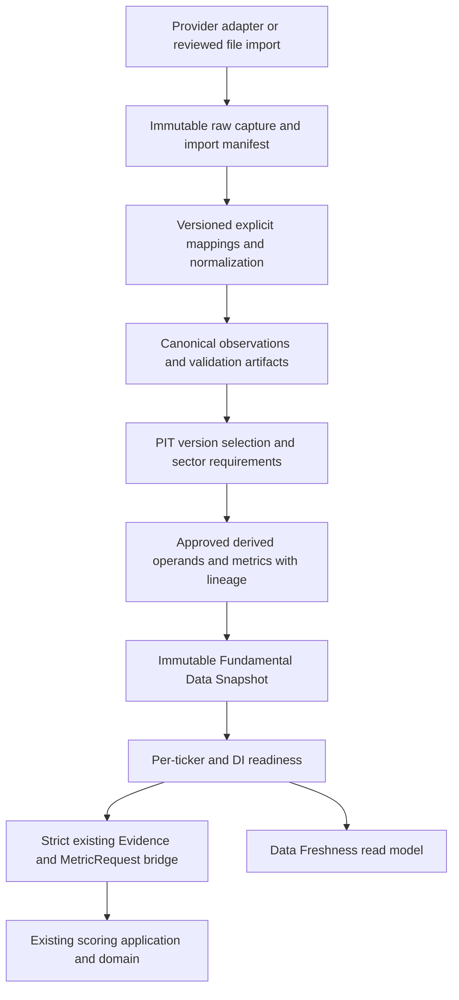

# Fundamental Data Engine — first-run design review

Date: 2026-10-08 (Asia/Ho_Chi_Minh). Status: **DESIGN REMEDIATED — READY FOR SLICE 1 REVIEW; IMPLEMENTATION NOT AUTHORIZED**.

Original audit checkout: `40a7f9557ea8492d80bebe8e3928bdbe171020d3`. Remediation re-audit: `df8cbefdf1ff2111f51836a4a9ea648d21478169`; working tree was clean before remediation. This report assesses checked-in code, contracts and evidence, not the contents of the user's private database. No credentials, personal captures or production database were read; no API account requests, migrations, live scoring, rankings or recommendations were run. External research below used public documentation only. Tests were inspected, not executed; their existence is not a new PASS claim.

Recommendation: build vendor-independent contracts and additive analytical storage first. Qualify a structured provider against original disclosures before integration. Preserve the existing evidence, methodology, exact arithmetic and immutable artifact architecture. Financial coverage is necessary but insufficient for a complete score: the current engine also requires human qualitative assessments and external gates.

## A. Repository audit

### Remediation re-audit and repository changes

Re-read AGENTS.md, this complete design, the relevant Section A governing clauses, current scoring Evidence/METRICS/application engine, effective-dated ReferenceData/Security contracts and Prisma schema before editing. Compared current HEAD with the original audit. The scoring contracts/reference model/schema inspected here retain the limitations identified below, so all three Major findings remain applicable.

Material change: the `src/infrastructure/tcbs/` adapter directory (including collect/sync/normalizer/token-session files), `src/infrastructure/config/tcbs.ts`, website session form/actions and `tests/integration/tcbs-sync.test.ts` were removed. Current integration is CLI capture/import (`api/test-tcbs.mjs`, `api/import-captured.mjs`, `api/token-session.mjs`) and immutable broker repository/read UI, not automatic website sync. `latestBrokerApiData` now reads at most 100 captures and groups by API ID; it is not a PIT/version-aware financial selector. No remediation restores deleted features. Source assessment is retained as the prior dated desk assessment, not new provider qualification.

### Authority reviewed

Paths are repository-relative. Logical paths printed inside older documents sometimes differ from physical paths; use the physical paths below. Some headers still say Draft/Approval Candidate despite the user's stated approved M1–M8 baseline. This report does not downgrade that authorization or silently edit headers. Freeze actual approved document hashes/approval references before implementing a production requirements matrix.

| Authority | Consequence for this engine |
|---|---|
| `docs/01 SYSTEM/INVESTMENT_POLICY.md` | VN30-only new capital; Stage 0; quality/health precede valuation; no forced deployment; portfolio truth separate. |
| `docs/01 SYSTEM/DECISION_FRAMEWORK_v1.0.md` | Score informs judgment; market/technical are secondary context; complete decision sequence remains authoritative. |
| `docs/01 SYSTEM/RISK_POLICY_v1.0.md` | Vetoes, leverage prohibition, confidence and portfolio constraints cannot be overridden by better data or scores. |
| `docs/01 SYSTEM/SCORING_MODEL_v1.0.md` | Frozen 25/15/15/10/20/10/5 category maxima; no extra API metric creates points. |
| `docs/03 SCORING/METRIC_DEFINITIONS.md`, §§2–3, 11–18 | TTM/current state, minimum 3Y/preferred 5Y trends; attributable common profit/average common equity; normalization, source hierarchy, missing rules, corporate-action comparability. |
| `docs/03 SCORING/SECTOR_NORMALIZATION.md`, §§5–14 | Sector-equivalent economics; special bank, securities, insurance, property, cycle and conglomerate treatment. |
| `docs/03 SCORING/SCORING_ENGINE.md` | Flow/technical excluded from permanent 100-point score; evidence-based assessment, not automatic ratio-to-points. |
| `docs/03 SCORING/RANKING_RULES_v1.0.md` | Reliable scoreability, confidence, category/eligibility gates, deterministic ties; no ranking policy changes. |
| `docs/02 DATABASE/DATA_MODEL.md`, `DATA_RULES.md`, `VN30_MASTER.md`, `SECTOR_MASTER.md` | Ledger owns investor economics; durable security identity, effective-dated master/reference truth, explicit quality and units. |
| `docs/07_VALIDATION/DATA_VALIDATION.md`, `HISTORICAL_VALIDATION_PLAN.md`, `FINAL_VALIDATION_REPORT.md` | Publication-time and restatement controls; AS-KNOWN distinct from AS-REVISED; historical validation remains blocked pending execution evidence. Specification completion is not certification. |
| `docs/08_CONTINUOUS_IMPROVEMENT/DATA_INITIALIZATION.md`, `INITIAL_SCORING_REPORT.md` | DI1–DI15 evidence, reproducible dataset identity, per-ticker readiness and independent review precede live scoring; SC1–SC12 still separate. |
| `docs/adr/0001-module-boundaries.md`, `0003-sqlite-prisma-persistence.md`, `0004-portfolio-ledger-and-accounting.md` | Dependency direction, explicit migrations, private local SQLite, decimal TEXT, immutable facts, projections remain derived. |

### Existing components and reuse

| Component / inspected files | What exists | Reuse / limitation |
|---|---|---|
| `src/domain/scoring/evidence.ts` | Versioned Evidence with durable securityId, source, FACT/ESTIMATE/ASSUMPTION, period, publishedAt, receivedAt, validThrough, units and quality. Validates future evidence and duplicate observation/period conflicts. | Final scoring boundary. It cannot represent nullable publication, raw vendor item, currency/scale, YTD or restatement chain. Do not force unknown dates into it. |
| `src/domain/scoring/metrics.ts` | Frozen `METRICS`, ordered operands, exact decimal formulas, comparability/normalization checks, missing result = null; bank exclusions. | Reuse formulas wherever operand semantics match. Formula IDs differ from document evidence IDs (e.g. ROE vs BQ-EQ-02); explicit crosswalk required. |
| `src/domain/scoring/scorecard.ts`, `methodology.ts`, `methodology/sectors.ts` | 11-sector taxonomy, 23 rubric assessments, HUMAN assessment requirement, confidence, evidence topics, external Stage 0/veto/risk, null total when critical inputs fail. | Keep assessment and gate ownership. Provider ratios cannot fill human rubrics or normalized estimates automatically. |
| `src/application/scoring/engine.ts`, `src/ports/scoring.ts` | Registry identity checked before persistence; score/rank application orchestration; analytical append/find port. | Add production readiness at application boundary later; current score() has no DI manifest lookup. Existing evidence checks alone do not enforce all initialization gates. |
| `src/domain/ranking/rank.ts` | Recomputes cards from pinned inputs; requires complete 30-member/card coverage; missing universe/card blocks ranking; external return and portfolio gates; deterministic ties. | Preserve whole-universe accounting. Ready subset must not silently become a supposedly complete VN30 universe. |
| `src/domain/portfolio/reference.ts` | Effective-dated identifier/membership/sector/coverage, tri-state membership; complete coverage requires 30 distinct members. | Reuse reference semantics and security IDs; ingestion-time universe/sector evidence still needs a pinned analytical reference manifest. Count alone does not prove official membership. |
| `prisma/schema.prisma` | Security, ledger, MethodologyRecord, AnalyticalArtifact, DecisionArtifact, workflow/marginal artifacts, BrokerObservation. | No fundamental observation, import batch, financial derivation or fundamental dataset snapshot tables. Security is already the shared durable identity; do not duplicate a company/security master. |
| `src/infrastructure/repositories/analytical-artifacts.ts`, scoring migration | Append-only SCORECARD/RANKING JSON + SHA-256; read integrity checks; triggers prevent mutation. | Reuse immutable body/hash pattern. Port/type and read discriminator accept only scorecard/ranking; cannot just insert FUNDAMENTAL_SNAPSHOT into it. |
| `src/infrastructure/repositories/broker-observations.ts`, `api/import-captured.mjs` | Raw captures plus normalized broker snapshots; hash checks; latest-by-API read view; CLI import preserves observations. | Reuse capture/lineage design, not private account tables for public issuer statements. Latest-success queries are not PIT fundamental queries. |
| `src/ports/current.ts`, `src/infrastructure/current-source.ts`, `src/shared/validation/current-source.ts` | Normalized local CurrentSource provider for portfolio prices/references/reconciliation/analyst review evidence. | This is portfolio-scoped, not a financial statement provider. Keep it; add a narrow fundamental provider port rather than widening portfolio source ownership. |
| `src/application/current/read-model.ts`, `src/application/dashboard/model.ts`, `src/ui/dashboard.tsx` | Current portfolio freshness/integrity plus historical artifacts; /data explicitly sets Fundamental freshness to null. | Extend read model/UI only after snapshot/readiness. No existing full-universe fundamental coverage counters. Broker capture/import success is not DI PASS. |
| `src/shared/time.ts`, `src/domain/portfolio/values.ts`, `src/infrastructure/db/exact-decimal.ts` | Canonical UTC instants/date-only, clock, decimal strings and BigInt decimal12 half-even arithmetic. | Reuse; do not introduce floating point or domain IO. Raw lexical values must survive normalization limits. |
| `src/infrastructure/config/database.ts`, `api/token-session.mjs`, `logging/logger.ts`, `app/server/`, `scripts/database.mjs`, `scripts/backup.mjs` | Private server config, allowlisted safe logging, server composition, explicit migration wrapper and backup/recovery workflow. | Preserve all TCBS controls. New credentials use analogous private server handling and are excluded from tracing, git, logs, raw headers and UI. |

### TCBS assessment from actual integration

`api/tcbs-api-catalog.json` explicitly records “Fundamental financial statements require an additional source.” Current CLI catalog covers profile/account/cash/positions/orders/matches/debt, tickerCommons(index=2) and securities metadata. Current `api/README.md` documents CLI testing/token cache and offline capture import; its introductory “no client” wording is stale relative to those scripts. Website sync and supplemental held-ticker intraday/supply-demand collection from the original audit are absent in this checkout. Market observations and portfolio holdings are not issuer financial statements; actual private coverage was not inspected.

No current adapter supplies issuer statement history, publication timestamps or restatement versions. This supports **TCBS currently insufficient**, not a claim that no TCBS product anywhere has fundamentals. The previously researched public portal describes trading/market/account capabilities; any separate analytics endpoint requires its own documentation, terms and qualification. No hidden endpoints or live requests are proposed by this remediation.

### Tests and boundaries inspected

`tests/unit/scoring.test.ts` already rejects future publication/reference evidence; `scoring-golden.test.ts` and `methodology-validation.test.ts` pin rules. `tests/integration/scoring-artifacts.test.ts` covers immutable round-trip, corrections, UPDATE/DELETE/REPLACE rejection, populated upgrade and ledger preservation. `portfolio-migration.test.ts`, `numeric.test.ts`, `isolation.test.ts`, `file-safety.test.ts`, `broker-observations.test.ts` and API session tests (current `tcbs-sync.test.ts` was removed) provide migration, exactness, security and adapter patterns. `tests/fixtures/database.ts` allocates private temporary DBs and runs migration with `--no-env-file`; `vitest.config.ts` uses UTC and one worker. Architecture checks in `scripts/check-boundaries.mjs` constrain even type imports and client transitive graphs.

Pure domain → domain/shared; ports → domain/shared/ports; application → ports/domain/shared/application; infrastructure may implement ports; server composition wires IO; UI consumes read models. No provider fetch, Prisma, node crypto, environment reads or wall clock in domain. No new dependency is required for the first slice. Before any future code, read the relevant installed `node_modules/next/dist/docs/` guides per AGENTS.md.

### Gaps, conflicts and migration implications

1. No complete issuer fundamental store/provider/normalizer/PIT selector/derivation manifest/readiness registry exists.
2. Existing `validateEvidence` uses publishedAt <= knownAt and receivedAt <= knownAt, with asOf <= knownAt. A historical decision must not gain later-publication data by moving knownAt forward. Future bridge must constrain decision availability separately before creating Evidence.
3. Scoring Evidence duplicates with the same observation and period conflict even when they represent a later restatement. Select one eligible version first; preserve all versions in storage, not all in a scoring input.
4. `calculateMetrics` checks equal operand units and (usually) equal periods, but does not prove canonical operand identity or correct average-equity lineage. Revenue/EPS CAGR endpoint observations need explicit comparable window operands to fit this contract. An adapter must build semantic operands, not merely pair any matching unit/period.
5. NIM, CAR, ROA and insurance formula coverage is not equivalent to adding those IDs to executable METRICS. Some approved items are evidence topics with qualitative/context requirements, rather than implemented formulas. Do not silently add formula/annualization policies.
6. Securities/insurance are described as possible metrics in sector normalization, not an unconditional mandatory numerical checklist. Requirements must reference the selected approved evidence route; unresolved applicability/definition is blocking.
7. Financial freshness depends on latest officially available period/audited FY, not generic elapsed days. Unknown freshness policy or incomplete disclosure monitoring remains UNKNOWN.
8. A portfolio snapshot/ledger watermark cannot stand in for a universe financial dataset. Reuse its lineage principles, retain distinct IDs and ownership.
9. Future schema is additive; no alteration of ledger transactions, portfolio projections, cost basis or broker captures. No production migration during this review. Security may have only held companies; universe identity initialization must later add authoritative Security records through the existing owner, not fabricate them.

## B. Fundamental data source assessment

Research date 2026-10-08. **F** = directly supported fact; **A** = planning assumption/inference; **U** = unknown requiring verification. Public product claims are not measured coverage, contractual rights, independent financial correctness or PIT certification.

| Candidate | Coverage and statement/history evidence | Dates, restatements and PIT | Access, limits, terms, reliability/stability and effort |
|---|---|---|---|
| Existing TCBS OpenAPI | **F:** audited repo has market/account integrations; no statement adapter; explicit source gap. Portal describes market and trading/account data. **U:** separately licensed fundamental offering. | **F:** current market capture often uses receipt time, not verified exchange publication; no fundamental version chain. Unsuitable as sole fundamental/PIT source today. | **F:** existing CLI API key + Smart OTP/JWT and private cache; automatic website sync from the original audit has been removed. **U:** statement entitlement/limits/terms. Stable enough for existing scope only; extra API would require separate qualification. |
| Original issuer disclosures plus official exchange/regulatory/index notices; controlled document import | **F:** issuer IR can expose quarterly consolidated statements and annual reports (FPT example linked below). **A:** all active constituents can be covered by a maintained disclosure register; must prove each. All three statements/notes depend on report. History depth varies. | Strongest evidentiary route if original document, publication record and every version are retained. **U:** precise publication time, archived originals and restatement history per issuer. Document signing/report date is not publication date. | Public pages may require no login; no universal documented bulk API established here. Automated downloads/rates/storage rights need site-specific verification. Manual/approved export ingestion avoids undocumented endpoints; high extraction/review effort and website/PDF layout changes. Original provenance does not eliminate extraction mistakes. |
| FiinGroup API Datafeed / FiinPro X | **F:** Datafeed documents corporate financial data; product guide advertises quarterly/annual listed-company history since listing. **A:** candidate for full VN30; API entitlement may differ from platform. **U:** actual 30/30, sector notes, consolidated vs separate, depth and field completeness. | **U:** item-level original availability timestamps, timestamp precision/timezone, AS-KNOWN query/version history, revisions and original PDFs. Fast update claim does not prove historical PIT. | **F:** documented API product, not a browser-only shortcut. **U:** auth scheme, quotas, SLA, price, local persistence/replay/export rights and contract duration. **A:** medium implementation effort and potentially more stable contractual support than a community bridge; sample proof required. |
| Vietstock DataFeed | **F:** official Vietstock materials list a DataFeed product. **U:** exact financial API/schema, quarterly/annual depth, VN30 sector coverage, note-level fields. | **U:** publication timestamps, original/restated versions and PIT access. Treat current tables as latest-revised until proven otherwise. | **U:** API docs, authentication, licensed storage/reuse, quotas and SLA. **A:** commercial alternative worth qualifying; medium/high effort until specification received. No website scraping proposed. |
| Vnstock library and underlying providers | **F:** maintained upstream README exposes fundamental balance-sheet access and API-key registration. Library is an access layer, not the original issuer source. **U:** pinned release/source-specific full statement/history coverage. Old TCBS examples are not evidence for a current documented TCBS OpenAPI fundamental service. | **U:** exact availability fields/version retention. Receipt time and period labels alone fail historical PIT. Do not infer original vintages from current historical tables. | **F:** current README includes key/quota arrangements; do not assume anonymous/unlimited use. **U:** numerical quota for selected tier/release, upstream permission and data storage rights (software license is separate). **A:** extra Python/runtime bridge and upstream schema risk; lower fit for this TypeScript repo. Research-only candidate until terms/PIT proof. |
| WiChart / WiData | **F:** wichart.vn redirects to widata.vn; public retrieval exposed no usable specification. **U:** all coverage, statement/history fields, API access/auth/quotas/terms/SLA. | **U:** publication and revision metadata. No PIT claim justified. | **A:** possible provider to evaluate only after documentation and entitlement. Complexity/stability cannot be responsibly rated yet; no hidden endpoint integration. |

Source facts: [TCBS developer portal](https://developers.tcbs.com.vn/); [FiinGroup API product](https://dff.fiingroup.vn/ApiDataFeed?lang=vi-vn); [FiinGroup API documentation](https://datafeed.fiingroup.vn/api-doanh-nghiep); [FiinPro X guide](https://docs.fiinpro.com/english); [Vietstock official overview](https://en.vietstock.vn/about-us.htm) and [official product guide](https://static1.vietstock.vn/vietstock/2023/VSTF_Huong-dan-su-dung_ver2023.pdf); [Vnstock upstream README](https://github.com/thinh-vu/vnstock); [WiChart redirect](https://wichart.vn/); [FPT investor disclosures](https://fpt.com/en/ir). These establish only the limited facts explicitly labeled above.

### Safest practical strategy (recommendation, no provider commitment)

Use original audited/official issuer disclosure evidence as the provenance/resolution anchor under M3 §3.6 source hierarchy. Qualify FiinGroup first and Vietstock as an alternative structured acquisition route; retain original disclosure references for disputed, sector-specific and high-sensitivity items. If provider qualification fails, use reviewed document/export imports with full provenance and explicit missing states. Do not backfill a guessed publication date or automatically switch to an undocumented source after a failure. Community/website access is not the default production route.

Before choosing a provider obtain (without contacting anyone in this run):

- A frozen 30-ticker official universe and an item × ticker × period × sector coverage export. Include 3Y minimum/5Y preferred trends, original and restated examples, quarter/YTD/annual distinctions, consolidated/parent scope, audit status and notes.
- Documented API fields, lexical precision, currency/multipliers, page-completion semantics, version guarantees, authentication, quotas, timeout/retry policy and SLA/change notification.
- Examples proving original public availability timestamps with timezone/precision and documentary references. Test a delayed Q2 release and later revision. Ask whether historical values are revised in place.
- Contract rights for local raw retention, historical replay, derived metrics, backups and exported review evidence. Confirm any restriction on retention after contract termination. No assumption that a paid subscription grants redistribution.
- Independently reconcile representative bank, securities, insurance, cyclical and ordinary issuers, then account for every active member; sector probes may use non-VN30 fixtures without making them investment eligible.

Source selection is evidence-driven, not based on the most attractive score. This assessment is complete as a desk assessment; source acceptance remains unverified.

## C. Gap analysis and sector requirements

| Current system | Required engine | Gap / owner |
|---|---|---|
| Effective-dated reference contract; TCBS tickerCommons capture | Official dated universe/sector evidence and complete coverage | Qualification/import manifest, not current ticker list as historical truth. |
| Broker account/market raw storage | Public issuer statement observations by durable security | Narrow issuer capture port and append-only repository. |
| Generic scoring Evidence | Canonical raw/normalized financial item with fiscal/scope/version metadata | Canonical observation contract plus strict bridge to existing Evidence. |
| Decimal strings and formulas | Explicit vendor maps, scale/sign/period/scope transformations | Versioned mappings and auditable transformations; no automatic financial normalization. |
| Evidence-level quality/PIT checks | Item validation, conflicts/restatements, period graph and publication controls | Pre-score validation and eligible-version selector. |
| Embedded score metrics/operands | Reusable approved derivations with full lineage | Thin wrapper around existing formulas, explicit derived operands; no competing scoring calculator. |
| Portfolio snapshots and frozen score bodies | Immutable universe financial dataset manifest | Distinct fundamental snapshot; reuse body/hash persistence pattern. |
| Null fundamental UI freshness | Per-ticker required-route completeness and all-input readiness | Application readiness + read model; M8 DI enforcement at production entry. |
| Synthetic regression evidence | Independent real-data initialization evidence | Full universe ingestion, independent checks and DI sign-off; no PASS from code. |

### Canonical capture inventory (not a new scoring metric list)

Income: consolidated revenue, gross profit when applicable, operating profit, EBIT with definition, profit before tax, total NPAT, NPAT attributable to common shareholders, basic/diluted/reported EPS and denominator basis. Balance: assets, total equity, common equity/minority distinction, cash equivalents, restricted/unrestricted cash, interest-bearing debt and short/long-term components. Cash flow: CFO, investing/financing flows, capex line items and sign convention; FCF is derived, never presumed equal to investing outflow.

Each field has applicability and a documented approved use. Bank net interest/operating income is not industrial revenue; total equity is not automatically common equity; NPAT is not automatically attributable common profit; investing cash flow is not capex; operating profit is not automatically normalized EBIT; reported EPS is not normalized/action-adjusted EPS. Accept negative earnings/equity/CFO/FCF where economically possible. Capture shares and corporate-action terms where required for comparable EPS/BVPS. Estimates, conservative valuation ranges, forecast dividends and analyst adjustments remain explicitly separate from reported FACTs.

| Sector | Approved evidence needs | Implementation boundary |
|---|---|---|
| BANK | M3 metric definitions §11.1 and sector §5: sustainable ROE/ROTE, NIM quality, fee quality, cost-to-income, CASA/funding; CAR/CET1 where available, NPL/coverage, LDR/liquidity, credit cost/stress; loan/deposit/fee/BVPS/EPS growth and capital consumption. | Bank-specific statement/notes operands; preserve regulatory definitions. NPL/COVERAGE/CASA/ROE already have formula support. ROA may be sector-appropriate evidence under scoring model §5.1 but is not blanket mandatory and has no existing MetricId. NIM/CAR annualization/calculation definitions require an approved mapping or reported evidence, not invented formulas. No industrial Debt/Equity, CFO conversion, interest coverage or ROIC substitutions. |
| SECURITIES | Sector §13.1: through-cycle ROE, recurring fees, market-share economics, proprietary-trading dependence, margin-loan concentration, liquidity/capital adequacy, turnover sensitivity; sustainable P/B/P/E context. | Possible evidence routes need explicit applicability and reviewer approval under existing model. Do not treat trading gains as recurring fees or industrial cash conversion as automatically equivalent. |
| INSURANCE | Sector §13.2: underwriting profitability, combined ratio where applicable, reserve adequacy, investment-income quality, solvency capital, premium-growth quality. | Insurance scope and definitions vary (e.g. combined-ratio applicability); no universal mandatory combined-ratio or industrial net-debt shortcut. Missing precise formula ownership is BLOCKED_REQUIREMENT_UNRESOLVED. |
| Non-financial sectors | ROIC/normalized ROE as appropriate, margins, CFO conversion/FCF, net debt/unrestricted cash, maturities/coverage, revenue/EPS growth. Property requires collections/backlog/legal/inventory/RNAV; retail store economics; technology recurrence/concentration; materials through-cycle; utilities/energy and conglomerates use approved sector matrix. | Support supplement/document evidence, not only three statements. Conglomerate cash cannot automatically net holding debt; cycle and one-off adjustments need human rationale and sources. |

A versioned requirements crosswalk must contain document metric/evidence ID → rubric topic → applicable sector/evidence route → canonical inputs → existing executable metric (if any) → period/corporate-action/normalization constraints → missing rule. This is the acceptance artifact for completeness; a hardcoded universal 20-field checklist is insufficient. Optional fields cannot become mandatory simply because a vendor supplies them.

## D. Proposed architecture



Suggested modules: `src/domain/fundamentals/{contracts,validation,requirements,normalization,selection,derivation,snapshot,readiness}.ts`; `src/ports/fundamentals.ts`; `src/application/fundamentals/{ingest,build-snapshot,readiness,scoring-input}.ts`; `src/infrastructure/fundamentals/` adapters/maps; `src/infrastructure/repositories/fundamentals.ts`; future server wiring under `app/server/`. Names are proposals, not generated code. Keep financial-statement source items distinct from scored derived MetricId; reuse Sector, Security, time, decimal and existing metric definitions.

### Governed Canonical Financial Item Registry (MAJOR-2)

The future registry is an immutable, machine-readable manifest, reviewed against approved M3 evidence/operand definitions. Each approved release has `registryVersion`, `registryHash`, methodology/document/approval references, recorded/effective dates and governance state. Use the existing methodology identity/approval mechanism; a machine-readable record cannot approve itself. Existing registry metadata checks do not independently certify content approval: acceptance must verify external owner approval binds the exact registryHash and crosswalk release, and pin that association in the immutable manifest. Slice 1 proposes a versioned checked-in JSON manifest with runtime validation and approved release references, not a new accounting master service or a complete invented taxonomy.

Each entry governs:

| Field | Governed meaning |
|---|---|
| `itemId`, `name`, `meaning` | Stable vendor-independent identity, readable name and precise economic/accounting definition. |
| `statementType`, `measurementSemantic` | Income/balance/cash-flow/approved supplementary family; FLOW or STOCK. Ratios/per-share evidence need an explicitly governed separate measurement semantic, never falsely labeled stock/flow. |
| `allowedUnits`, `currencyApplicability`, `signConvention` | Declared monetary/share/per-share/ratio units, whether currency is required, source and canonical sign direction. |
| `allowedReportingScopes`, `sectorApplicability` | CONSOLIDATED, SEPARATE_STANDALONE or explicitly approved later scopes; applicable sectors and conditions. |
| `evidenceTopicMappings`, `operandMappings` | Approved document metric IDs/rubric topics and existing executable MetricId + ordered operand position where applicable, with period/normalization requirements. Empty/unresolved executable mapping does not create a formula. |
| `itemDefinitionVersion`, `methodologyIdentity`, `authorityReferences` | Versioned definition and approval provenance pinned by registry release/hash. |
| `status`, `deprecatedFrom`, `supersededBy` | Explicit deprecation/supersession; no reusing an itemId for changed economics. Compatible clarifications create new versions; meaning-changing concepts require a distinct item identity. Old manifests remain resolvable. |

Illustrative identities only: REVENUE, EBIT, NET_INCOME, NET_INCOME_ATTRIBUTABLE_COMMON, TOTAL_ASSETS, COMMON_EQUITY, CFO, CAPEX. These are not automatically approved registry entries. `netProfit`, `profitAfterTax`, `netIncome` and `NPAT` are raw vendor labels; none can enter canonical observation identity without an approved mapping to an exact registry item/version. Preserve raw provider identifiers/labels/field path and map **Provider Field → Canonical Financial Item**, then approved topic/operand—not arbitrary free-form observation text. Unknown/unapproved/deprecated-for-new-use mappings retain raw evidence and block canonical acceptance; no automatic label aliasing. NET_INCOME and NET_INCOME_ATTRIBUTABLE_COMMON are not interchangeable.

FLOW measures activity over a period (revenue, CFO, profit); STOCK measures a balance at a date (assets, cash, debt, equity). TTM may aggregate four comparable non-overlapping quarterly FLOW values; STOCK is not summed into TTM. YTD-to-quarter subtraction applies only to comparable cumulative FLOW with identical scope/basis and eligible vintage. Average equity/invested capital is a derived balance from documented STOCK dates and an approved averaging method, not sum of quarterly balances. ROE uses normalized attributable common-profit FLOW over the measurement window and average common-equity STOCK for that window; ROIC similarly needs approved NOPAT and invested-capital definitions. Growth compares like-for-like FLOW windows or STOCK dates; EPS requires its governed per-share/action denominator semantics. Equal units alone do not establish economic or period comparability. Where an averaging, sector metric or annualization definition is unresolved, preserve evidence and block the affected derivation rather than invent it. No new MetricId or scoring formula is authorized.

### Observation, scope, units and currency

Canonical observations retain securityId and supplied ticker/identifier mapping reference; `itemId` plus immutable registry version/hash/item-definition version; statement family and FLOW/STOCK (resolved and checked against registry); reporting scope/segment/accounting/audit basis; periodStart/end/type, fiscalYear/quarter/calendar; the distinct publication/receipt fields below; raw capture/field locator/raw lexical value/label; declared source unit/multiplier/currency; exact normalized value/unit/currency or null; data presence/quality/applicability; mapping/version/transformation trace; revision kind and predecessor. QUARTER/YTD/ANNUAL apply to appropriate FLOW/per-share periods; INSTANT captures STOCK observation date. TTM is explicitly derived or a labeled provider aggregate with verified constituent lineage.

Reporting scope is explicit: CONSOLIDATED and SEPARATE_STANDALONE remain distinct even for identical values. Other scopes require registry approval. For listed groups whose approved metric route uses consolidated economics (e.g. M3 §12.1 comparable consolidated revenue), standalone cannot silently fill missing consolidated data. A fallback requires an approved route/source-rule reference, purpose, rationale and retained original scope; affected quality/confidence/readiness must reflect the substitution. Without that route, block/N/R under existing missing rules. A source hierarchy does not authorize a scope substitution.

Illustrative mapping pending registry approval: vendor `netProfitAfterTax` → approved NET_INCOME definition, not automatically attributable or normalized common profit. Declared `15000` million VND × `1000000` yields `15000000000` VND. Percent `15` explicitly declared PERCENT yields RATIO `0.15`; RATIO `0.15` stays `0.15`. Source sign inversion must be explicit and registry-consistent (e.g. capex cash outflow vs positive expenditure operand); investing flow is not CAPEX. Unknown scale/sign/scope or excess exact precision blocks normalization; preserve raw facts without silent rounding.

Ingestion preserves reporting currency. Unit-scale conversion within a currency is distinct from FX: million USD stays USD, never silently becomes VND. Monetary values require currency; nonmonetary values use null currency. A later approved FX transformation must retain source/target currency, approved FX source and immutable observation ID/hash, FX date/time and availability, exact rate and quote direction, conversion methodology (including applicable FLOW-period vs STOCK-date convention), transformation version and result. If the approved rate/source/method is absent or future at the cutoff, the required VND-dependent operand/readiness remains blocked/N/R; no implicit currency conversion. Existing scoring Evidence supports VND, so non-VND values cannot be bridged as VND merely by changing a unit label. Slice 1 represents currencies/lineage only and implements no FX.

Separate `dataPresence` AVAILABLE/MISSING/SOURCE_UNAVAILABLE from governed information availability below; quality VALID/WARNING/INVALID/CONFLICTING/UNKNOWN; freshness CURRENT/AGING/STALE/UNKNOWN; applicability APPLICABLE/NOT_APPLICABLE/UNRESOLVED. Numeric zero remains AVAILABLE with `"0"`; missing normalized value is null. NOT_APPLICABLE needs an approved route reason. Readiness INSUFFICIENT confidence does not broaden current scoring HIGH/MEDIUM/LOW semantics.

### Canonical information availability and PIT (MAJOR-1)

| Field | Meaning / evidence requirement |
|---|---|
| `periodStart`, `periodEnd` | Economic reporting window or STOCK date; never information availability. |
| `reportDate` | Issuer/report signing date if known, with its own precision/reference; never automatically publication. |
| `publishedAt` / publication date | Issuer/exchange/public disclosure evidence for the underlying reported version; nullable. ISSUER_RESTATEMENT needs its own disclosure; provider/mapping corrections retain underlying issuer publication plus separate correction knowledge provenance; they do not invent a new issuer publication date. |
| `publicationPrecision` | TIMESTAMP, DATE_ONLY or UNKNOWN; date-only uses a date field plus source timezone, not an invented midnight instant. |
| `publicationStatus` | VERIFIED or UNKNOWN; conflicting/unverified vendor claims cannot be VERIFIED. Retain claimed date separately in raw provenance. |
| `providerReceivedAt` | Optional verified provider receipt for this version; provenance/precision retained, not a substitute for public disclosure. |
| `retrievedAt`, `ingestedAt` | Actual local receipt and storage times, separately recorded; no backdating. Retrieval is not proof of earlier publication. |
| `availableAt`, `availabilityStatus` | Nullable **derived** canonical admissibility boundary and VERIFIED/UNKNOWN result, with policy/mode and provenance-input references; never an accepted vendor-provided scalar. |

Proposed initial operational AS-KNOWN policy: derive a `publicBoundary` from verified original publication evidence. Exact timestamp uses that instant. Verified date-only may use the start of the following local day as a conservative boundary **only after this operational policy/timezone is approved and versioned**; it is labeled a policy boundary, never reported as an exact publishedAt. Unknown publication/timezone yields UNKNOWN with null boundary. A provider assertion of availableAt alone cannot satisfy verification.

For a known publication/version and a valid local receipt chronology, derive:

`availableAt = max(publicBoundary, retrievedAt, ingestedAt, verified providerReceivedAt if applicable, correction/interpretation knowledge boundaries if applicable)`.

Record the policy identity/version, analysis mode, input IDs/hashes and rationale. Slice 5 appends an immutable availability assessment referencing the foundational observation hash and provenance inputs; it never updates the foundational null/UNKNOWN fields. Selectors read the explicitly pinned assessment, not a mutable availableAt cache on observations. Receipt after ingestion, impossible publication/receipt chronology or uncertain required provenance is invalid/UNKNOWN; a max calculation does not legitimize contradictory evidence. Missing optional provider receipt need not block when authoritative publication and local capture establish the route. Material provider/mapping corrections add their actual system-known correction boundary; knowledge of a corrected interpretation cannot be backdated to the original report's publication. A disputed provider receipt remains visible and cannot be selectively dropped to obtain readiness.

Operational AS-KNOWN admission requires availableAt VERIFIED and <= `systemKnownAt` <= `decisionAsOf`, eligible period/scope/version, freshness/quality and required evidence rules. A later build time does not extend historical knowledge. Unknown publication fails closed for required inputs even if retrievedAt is known. No reporting/signing date, guessed delay or provider timestamp can make it scoreable.

Example (dates shown in Vietnam local time; exact instants still require evidence): Q2 end June 30, report signed July 22, public exchange publication July 25, provider receipt July 25, local retrieval July 26. July 10 excludes the report. July 22 signing does not admit it. Verified public knowledge may begin July 25, but this local operational system cannot know it before July 26 and actual ingestion; availableAt is the latest required boundary. If publication is only date-known, the approved conservative policy also waits until July 26 00:00 local; unknown publication remains UNKNOWN even after local retrieval. A July 25 local decision is excluded despite provider receipt that day. At/after actual July 26 ingestion, availability can be admitted only if remaining gates pass.

Keep `decisionAsOf`, `systemKnownAt`, market/fundamental cutoffs and actual snapshot `builtAt` distinct. A historical-public research dataset built later requires its own explicitly approved availability policy/original vintage proof and is not operational AS-KNOWN replay. That bridge remains deferred. Existing scoring Evidence requires actual receivedAt <= knownAt and publishedAt <= receivedAt; date-only admission must not fabricate publishedAt to satisfy it. Unrepresentable publication precision remains blocked at the current scoring bridge until a separately reviewed compatible contract exists. No Evidence semantics/code changes in this task or Slice 1.

AS-REVISED is a separately labeled diagnostic/latest-valid revision mode at an explicit revision cutoff; it cannot replace AS-KNOWN or manufacture prior knowledge. Unknown publication is still visible and never converted into VERIFIED by choosing revised mode.

### Revision lineage and source conflicts (MINOR-1 and MINOR-4)

Revision taxonomy: ORIGINAL; ISSUER_RESTATEMENT (issuer changes previously reported financials); PROVIDER_CORRECTION (provider data/parsing correction, not an issuer statement change); MAPPING_CORRECTION (local mapping/interpretation repair). Repeat retrieval is another receipt event, not a restatement. Each revision retains one immediate revision predecessor (`supersedesObservationId`); other contributing transformation/source ancestors are immutable referenced lineage, not additional immediate supersession edges. A later multi-parent derivation may use explicit lineage edges in its owning slice without overbuilding Slice 1. Each revision also retains issuer/provider version identifiers, reason, documentary evidence, correction disclosure/receipt/ingestion boundaries and policy/mapping versions. Never overwrite an earlier observation. The PIT selector resolves only versions knowable at the cutoff; unexplained changed content remains CONFLICTING/UNKNOWN. Semantic transformation corrections may need a separately labeled corrected replay; they cannot silently replace the operational as-calculated record.

Source priority governs eligible **selection**, not evidence retention. Preserve all source identities, raw lexical and normalized values/currencies/scopes/periods, immutable captures/observations and material conflict findings. A reviewed selection artifact records candidates, discrepancies, selected value or null, applicability/availability, rationale, authoritative resolution reference, selector/policy version and decision/knowledge cutoffs. The approved hierarchy may select higher-priority evidence only within its resolution rules; it does not erase a disagreement. Unresolved material conflicts remain visible and block affected outputs. No generic latest-wins, averaging or favorable-value choice. Latest eligible issuer restatement within a documented vintage chain is not permission to select whichever unrelated source arrived last.

Mandatory PIT regression remains: Q2 end `2026-06-30`, publication `2026-07-25`, as-of `2026-07-10` → excluded from selected and derived inputs. Slice 5 also tests reportDate July 22, provider receipt July 25, local retrieval/ingestion July 26, unknown/date-only publication, exact boundaries, later revisions/corrections and false provider availableAt.

### Validation

Structural: valid durable security/ticker resolution, membership/sector at requested date, recognized canonical item, fiscal calendar and period ordering, numeric lexical parse, declared unit/currency/scale, field scope, payload schema/page completeness and valid timestamp chronology. Unknown identity/metric never flows to scoring; raw rejected evidence remains auditable.

Financial: negative total assets/debt where impossible; share count conventions; fractions bounded only for quantities that mathematically require it (e.g. NPL/CASA); coverage ratios can exceed 100%, ROE/ROA/NIM are not universally clamped to 0–100%. Negative EPS/profit/CFO/equity is possible. Zero denominators yield N/R or blocked according to approved rule. Compare debt components, balance-sheet identities and price × shares vs market cap where compatible; permit documented rounding, minority/scope and accounting distinctions. Suspicious discontinuity or 1,000×/1,000,000× shift triggers review and blocks if materially unresolved, never automatic rescaling/deletion. Numerical materiality tolerances require operational ownership/version, not a threshold chosen to get PASS.

Cross-period: compatible quarter/YTD/annual flow semantics, no gaps/overlap in TTM, no summing balance-sheet stocks or EPS indiscriminately; YTD subtraction only from comparable scope/version periods; restatement-consistent inputs, average balance lineage, corporate-action comparability, one-offs/cycle adjustments and denominator period pairing. Completeness follows approved sector/evidence-route requirements. Validation artifacts record rule/version, target IDs, severity, result, issue ID, reviewer/resolution evidence and timestamp.

### Derivations, snapshot and readiness

Reuse `calculateMetrics` for existing formulas with correct canonical operands and request normalization. Derived records include formula identity/version, methodology/document hashes, ordered observation/derived input IDs, period(s), normalization rationale/references, units, exact result or null/reason, precision policy and calculatedAt. Derived operands (average common equity, TTM CFO, normalized common profit, corporate-action-adjusted EPS) need their own lineage; vendor ROE is a reported provider ratio, not an unexplained internal calculation. Financial normalization involving judgment remains an explicit reviewed adjustment. Confidence cannot exceed weak required inputs by default.

### Dataset content identity vs snapshot build/run identity (MAJOR-3)

`fundamentalSnapshotContentHash` identifies deterministic investment-relevant content; `runId` identifies a particular build event. Two builds can have different runIds/builtAt/operator while resolving the same contentHash. The M8 Data Snapshot reference carries both identities; a scoring binding pins contentHash **and** the selected run/review acceptance evidence. DI review is not transferred automatically between runs merely because their content hashes match.

The canonical content manifest includes selected canonical fact/derived semantic fingerprints, durable identities, registry/mapping/methodology and availability-policy versions/hashes, periods/scopes/units/currencies, decision/knowledge/market/fundamental cutoffs and mode, investment-relevant availability provenance/boundaries, pinned universe/sector/market/reference content, derived operand ordering/formulas, deterministic quality/freshness/findings, conflict resolutions, required exclusions/missing states and readiness/requirements policy. Any change to these interpretation-relevant facts or policies changes content identity.

Canonicalization is versioned: schema-fixed field set, code-point sorted object keys and unordered sets; preserve ordered formula operands, canonical decimal/UTC transport and distinct null/zero/unknown states. Currency, scope, semantic meaning, publication precision, correction knowledge boundaries and source-policy decisions are never treated as irrelevant differences. Exclude JSON whitespace/key-order differences and build timestamps. Hash canonical semantic fact content, not raw serialized observation bodies with irrelevant transport formatting; raw payload/body hashes and actual storage IDs remain checked in run provenance. A new retrieval event that changes the chosen operational knowledge boundary is investment-relevant and changes content; an unselected import or unrelated batch is not. No arbitrary caller exclusion list may hide investment-relevant fields.

The immutable run envelope includes runId, contentHash, builtAt, software/build identity, operator/process, actual source/import batches, selected storage IDs/raw and body hashes, validation run, review context and exact manifest digest. Software execution identity is run metadata unless a version changes interpretation/algorithm, in which case its governing semantic version is also content. Derived calculation execution timestamps are run metadata; their input availability/correction boundaries and governing formula/precision versions remain content. Elapsed validation time/reviewer signing time is run metadata; deterministic validation findings/policy and selection-resolution facts are content. A run-to-content binding verifies each selected storage record's semantic fingerprint and raw integrity; missing/tampered references fail closed even when contentHash appears valid.

Seal content, members, readiness and run provenance atomically. Rebuilds create immutable new run envelopes and may reuse content; corrections never modify old runs/content. DI12 compares canonical content/input reproducibility, while replay checks pinned original lineage; independent validation links its own execution to the same governed content. Audit/incident investigation uses runId for execution/operator/import/software provenance and contentHash to establish whether facts/interpretation changed. Changing only builtAt must not masquerade as a dataset correction.

Slice 5 acceptance tests: (1) reordered equivalent inputs/key ordering/whitespace → same contentHash; (2) same governed content, different builtAt → same contentHash and distinct runId; (3) changed selected observation → different contentHash; (4) changed interpretation-relevant canonical mapping/methodology/policy → different contentHash; (5) tampered manifest or storage/run-to-content mismatch → integrity failure; (6) new imports not selected under frozen cutoffs → old contentHash reproducible with a new runId and original eligible lineage. Also test selected receipt/correction boundary changes alter content and old manifests remain immutable.

Readiness table: ticker/security | universe | market | fundamentals | valuation inputs | flow/technical | evidence confidence | assessment/gate completeness | ready for scoring | blockers. Flow/technical may be NOT_APPLICABLE for permanent M3 score with baseline reference, but required for relevant M4 workflow; never add points or always block M3 for an optional overlay. Data-ready, fully score-ready and actionable remain distinct. Missing bank NIM quality evidence can produce `BLOCKED_MISSING_NIM_EVIDENCE`; unknown publication `BLOCKED_PUBLICATION_UNKNOWN`; stale statements `BLOCKED_STALE_FUNDAMENTALS`; missing human rubric/gate evidence `BLOCKED_ASSESSMENT_REQUIRED`. These are illustrative reasons, not claims about actual tickers.

Future production scoring integration must look up sealed snapshot and matching evidence/model/universe, check required DI PASS with independent review artifact and per-ticker score readiness, and assemble strict existing input. A caller-supplied READY boolean is insufficient. Keep synthetic test paths explicitly scoped; no bypass for FORMAL production. Old score artifacts without the new dataset link remain immutable historical artifacts and cannot claim new production readiness.

## E. Proposed schema changes — no migration applied

Physical design follows existing SQLite TEXT timestamps/decimal strings and JSON-body/hash artifact patterns. This is an entity/constraint proposal for review, not executable Prisma/DDL. Slice 1 implements only the foundational subset listed in G/H; later tables are shown to review the full direction before migration.

| Proposed entity | Fields / reason | Indexes and constraints |
|---|---|---|
| Canonical registry manifest (Slice 1; no new registry table) | Versioned validated JSON definitions/crosswalk, stable itemId, FLOW/STOCK semantics and all governed fields in D; release hash/authority references | Immutable approved release pinned by observation; runtime membership/version validation. Reuse methodology registry; no self-approval or duplicate Security/master. |
| FundamentalSourceVersion | id, provider identity, documentation/terms references, adapter/schema version, declared coverage/temporal limitations, recordedAt, body/hash | Immutable identity. Credentials are excluded. Version new terms/capabilities without editing history. |
| FundamentalImportBatch | id, sourceVersionId, request/import fingerprint, retrieval started/completedAt, ingestedAt, completion/error state, body/hash including page/capture manifest | FK source; index(sourceVersionId, completedAt); unique import execution identity. Immutable terminal manifest; partial batch can retain captures but cannot claim complete coverage. No mutable job status required in this initial design. |
| FundamentalRawCapture | id, sourceVersionId, importExecutionId, request/resource fingerprint, sourceRecordId/version nullable, retrievedAt, mediaType, response status, payload text or content-addressed blob reference, payloadHash, safe document reference | FK source; index(sourceVersionId, retrievedAt), index(importExecutionId). No authorization headers/token-bearing URLs. Preserve retrieval occurrence separately from payload content deduplication; same value retrieved twice has two receipt events. Batch manifest resolves captures without cyclic mandatory FKs. |
| FundamentalObservation | id, rawCaptureId, securityId, identifierReference, itemId/registryVersion/hash/itemDefinitionVersion, statement/measurementSemantic/scope/segment/accounting/audit basis, periodStart/end/type/fiscalYear/quarter, reportDate + precision/reference nullable, publication timestamp or date/precision/status/timezone/evidence ref, optional providerReceivedAt/provenance, actual retrievedAt and ingestedAt, nullable derived availableAt/status/policy/mode/input refs (future derivation, initially UNKNOWN), source version, raw identifier/label/field path/value/unit/multiplier/currency, normalized decimal/null and unit/currency, explicit scope fallback/FX lineage references if applicable, mapping version/transform trace, recordVersion/revisionKind, supersedesObservationId nullable, dataPresence/quality/applicability, body/hash | FK Security/capture/predecessor RESTRICT; index(securityId,item,scope,periodEnd), index(sourceVersion,ingestedAt), index(supersedesObservationId). Unique(capture,item,scope,period,fieldLocator,mappingVersion) for reprocessing idempotence; not unique(security,item,period), which would erase conflict/revision evidence. Typed checks enforce null/value/status compatibility and fiscal/temporal ordering; item membership/semantic/scope/unit rules validated against immutable registry. Slice 1 stores no VERIFIED derived availability and performs no selector or FX calculation; metadata fields/immutable body permit later derived artifacts without historical rewrites. |
| FundamentalValidationArtifact | id, ruleSetVersion, assessedAt, target refs, results/severity/issue refs, resolutions and reviewer, body/hash | Index(assessedAt); immutable, reference targets checked; later review/correction is a new artifact. Missing anticipated item represented as a finding, not fabricated source observation. |
| FundamentalDerivedMetric + DerivedInput | id, securityId, canonical/existing metric ID, formula/version, method/document/precision identity, periods, exact result/null, unit, calculatedAt, normalization, body/hash; ordered input rows with input observation or derived ID/hash | FK methodology/input targets RESTRICT; unique(derivedId,sequence); exactly one input target; index(securityId,metric,periodEnd). Validate acyclic graph and inherited quality in application/domain; formula not in SQL trigger. |
| FundamentalAvailabilityAssessment (Slice 5) | id, observationId/hash, policy/mode/version, provenance-input refs/hashes, publicBoundary/derived availableAt nullable, result VERIFIED/UNKNOWN or invalid finding, assessedAt, body/hash | Immutable append with FK observation RESTRICT; index(observationId,policyVersion), index(availableAt). Foundational availability fields stay null/UNKNOWN; no retrospective update. |
| FundamentalDataSnapshotContent (Slice 5) | contentHash, canonicalization/contract version, deterministic manifest defined in D including semantic selected facts/availability assessments/cutoffs/policies/readiness; canonical manifest bytes/hash | Unique contentHash; index(decisionAsOf,mode). Exclude execution timestamps/irrelevant serialization; preserve exact governed content. |
| FundamentalSnapshotRun (Slice 5) | runId, contentHash, builtAt, software/operator/process, import/capture/selected storage IDs and integrity hashes, validation run/review refs, immutable provenance envelope/hash | Unique runId; FK content RESTRICT; index(contentHash,builtAt). Multiple runs per content; atomic seal and verified run-to-content binding. |
| SnapshotObservation / SnapshotDerived / SnapshotTickerReadiness | contentHash + semantic member fingerprint; runId + actual observation/derived ID/hash lineage; per-security readiness body/hash with dimensions/blocker refs/requirements version | Content membership PK(contentHash,semanticFingerprint), readiness PK(contentHash,securityId); run lineage keys(runId,targetId); restrictive FKs; immutable membership/readiness. Full approved universe accounted for even when blocked. |
| ScoringDatasetBinding (later) | scorecardId, contentHash, runId, scoring input hash, requirements version, validation/DI acceptance reference, createdAt, body/hash | FK analytical artifact + content/run RESTRICT; unique(scorecardId). Check kind SCORECARD and exact input/model/cutoff match. No rewrite of existing scorecard bodies. Historical bindings cannot be retroactively invented without evidence. |

Normalized monetary values use decimal TEXT; raw lexical values may be nonnumeric and survive failed parsing. UTC timestamp strings must be canonical for ordering; date-only cannot masquerade as UTC timestamp. Unit/currency/state/statement/scope checks require explicit enum allowlists in runtime validation and feasible SQL CHECK constraints. Unknown future item identifiers do not automatically become approved metrics. No DB enum permits changing investment rules.

All new fact/artifact tables receive UPDATE/DELETE guards, including replacement resistance with existing recursive_triggers connection policy. Test direct SQL UPDATE, DELETE, INSERT OR REPLACE and ON CONFLICT mutation. Foreign keys use RESTRICT, never cascading deletion of provenance. Semantic conflicts are stored and resolved by a reviewed append-only selection artifact, not a unique key that discards the second source.

Migration safety: additive DDL only; review SQL/schema before any deployment; fresh and populated isolated DB upgrades, repeat deploy, reopen, schema/FK/trigger checks, byte/row identity comparisons for all old authoritative tables and deterministic portfolio replay. Never use default `pnpm db:migrate` on the user's DB during design or tests. Backup/recovery: retain verified pre-upgrade private backup and manifest; prefer forward correction. Restoring a pre-upgrade backup after new ledger entries would lose those entries—stop writers and preserve/reconcile post-backup authoritative events first. No destructive down migration or reset. Raw blob storage, if needed later, must be private, hash-verified and included in backup integrity/recovery tests; first JSON capture slice can use TEXT to avoid introducing unreviewed blob lifecycle complexity.

## F. DI1–DI15 mapping

**No DI gate is newly PASS.** The authoritative document records all as NOT EXECUTED. Below “partial” means reusable implementation exists, not acceptance; “source-blocked” means a required real-data dependency is unqualified. No private database inspection was used to infer actual coverage. No gate can be labeled already satisfied on evidence available in this audit.

| Gate / exact requirement | Audit status | Implementation needed | Evidence required for PASS |
|---|---|---|---|
| DI1 VN30 master source/effective date verified | Partial; official effective-date acceptance unverified | Pinned official notice/identity import and availability/effectivity metadata | Independent notice/source/date/hash verification for exact cutoff. |
| DI2 Active universe complete/no duplicates | Partial; reference contract/count checks | Universe manifest and duplicate/identity validation | 30 authoritative distinct active securities, reconciled additions/removals and negative duplicate tests. |
| DI3 Sector mapping complete | Partial; taxonomy/reference checks | Complete dated approved-sector mapping | All active members mapped at cutoff; mapping/source approvals and historical interval checks. |
| DI4 Required market data loaded | Partial/source coverage unverified | Full required price/history/corporate-action coverage with the required history and adjustment semantics | Every required ticker/field/cutoff with provenance, quality, freshness and completeness; TCBS HTTP PASS alone insufficient. |
| DI5 Required fundamentals loaded | Source-blocked; engine not implemented | Qualified statement/supplement provider, raw/observation repositories | Full sector-route coverage report, latest available/audited periods and required history; representative source reconciliation. |
| DI6 Period/unit normalization validated | Partial primitives; fundamental normalization absent | Explicit field/unit/period/scope maps | Independent expected-vs-actual unit/sign/YTD/TTM/denominator cases and real samples, scale-error negative controls. |
| DI7 Missing-data checks PASS | Partial score fail-closed; full checklist absent | Sector required-route completeness and absent item findings | Whole-universe required-input accounting; zeros vs missing; approved N/A/fallbacks; affected outputs blocked. |
| DI8 Freshness checks PASS | Partial current price/reference; fundamental policy absent | Class-specific disclosure monitoring/freshness policy | Latest-public-period/audited-FY evidence at cutoff; stale/unknown/new-disclosure regression and owned policy. |
| DI9 Conflict/impossible-value checks PASS | Partial generic conflict/decimal checks | Fundamental conflict, financial, scale and cross-period rules | Material issues resolved with source evidence; valid negatives/coverage>100% retained; unresolved conflicts blocked. |
| DI10 Derived metric lineage verified | Partial embedded metric operands | Stored derivation graph/semantic operands/version bridge | Independent formula recomputation and full traversal to raw captures; missing/weak quality propagation. |
| DI11 Point-in-time controls verified | Partial Evidence checks; source-blocked publication/vintages | Selector/modes/governed availableAt derivation/publication precision/revision controls | July 10/July 25 control; signing/receipt/ingestion/date-only/unknown/forged provider availableAt/correction tests plus authoritative publication/version provenance. |
| DI12 Data Snapshot ID reproducible | Fundamental snapshot not implemented | Deterministic manifest, seal/load and integrity verification | Identical governed content/policies reproduce contentHash across order/reopen/new build time; distinct runId per execution; selected fact/interpretation changes yield new content, tamper fails, unselected later imports preserve prior identity. |
| DI13 Required per-ticker readiness determined | Not implemented for universe; partial score validity | All dimensions, assessment/gate and DI integration | Every active security accounted for; blocked reasons reproducible; injection/direct FORMAL bypass tests. |
| DI14 Independent data-quality review PASS | Not executed | Review artifact linked to exact snapshot/build/tests | Independent expected-vs-actual checks, reviewer identity/sign-off, immutable dataset hash and exception register. |
| DI15 No Critical/Major data issue unresolved | Not demonstrated | Severity/issue/resolution register, review enforcement | Complete scoped register and independent verified closure/retests; not inferred from absence of findings or passing unit tests. |

DI acceptance is tied to exact snapshot/policy/build identity and required scope. Failed snapshots/evidence remain retained. A later refresh needs new acceptance/readiness, not reuse of an obsolete PASS. Source failures must stay visible while previously received values retain original timestamps. DI PASS does not itself certify all M7 gates or satisfy SC1–SC12.

## G. Implementation slice plan

Commands are proposed validation, **not run in this review**. For any DB-consuming command use an owned private temp directory, explicit absolute `DATABASE_URL`, no personal env file and no network; use `tests/fixtures/database.ts` pattern. Schema validation/generation also receive a harmless isolated URL; no migration/startup against default DB. Existing wrappers may load root `.env.local`, so prefer `node scripts/database.mjs <command> --no-env-file` with explicit isolation. All slices preserve approved scoring golden tests/boundaries.

### Slice 1 — canonical contracts and foundational schema

Scope: narrow observation/raw/source/batch contracts, governed machine-readable canonical registry/crosswalk, state/unit/period/scope/currency/publication-provenance validation and foundational additive tables only. Registry release approval is an explicit completion gate; defer unresolved sector formulas. Availability/policy/result contract fields remain representable but availableAt stays null/UNKNOWN; do not compute it in Slice 1. Implement append/read repository for foundational records, including integrity and private test fixtures. No fetching, normalization engine, FX conversion, PIT selector/availability evaluator, derived metrics engine/tables, snapshot builder/tables, DI acceptance engine, scoring readiness integration, UI, live scoring/ranking, valuation or decision logic.

Expected files: `src/domain/fundamentals/contracts.ts`, `validation.ts`, a validated canonical-registry JSON manifest/loader contract; `src/ports/fundamentals.ts`; `src/infrastructure/repositories/fundamentals.ts`; `prisma/schema.prisma`; one new reviewed additive migration; `tests/unit/fundamentals-contracts.test.ts`, `tests/integration/fundamentals-repository.test.ts`, `fundamentals-migration.test.ts`; extend owned DB fixture only as necessary; contract/crosswalk review artifact under this directory. Reuse shared Security/Sector/time/decimal rather than duplicate them.

Tests: exact decimal/null/zero, units/currency, unknown dates, impossible chronology, raw preservation, duplicate identity/conflicting period versions, restrictive FKs, immutable raw/observation round-trip and UPDATE/DELETE/REPLACE guards; existing populated ledger/broker/artifact preservation plus reopen/repeat deployment. Fixtures preserve FLOW vs STOCK, consolidated vs standalone, non-VND currency without conversion, ORIGINAL/ISSUER_RESTATEMENT/PROVIDER_CORRECTION/MAPPING_CORRECTION, report signing vs publication and provider/local receipt. Reject arbitrary item aliases, scope fallback without an approved route and non-null VERIFIED derived availableAt in this slice; conflicts retained without latest-wins. No admissibility claim yet.

Commands: isolated `node scripts/database.mjs validate --no-env-file`, generate, `pnpm exec vitest run tests/unit/fundamentals-contracts.test.ts tests/integration/fundamentals-repository.test.ts tests/integration/fundamentals-migration.test.ts`, `pnpm test:boundaries`, `pnpm typecheck`, `pnpm lint`, `pnpm test:portfolio`, `pnpm test:scoring`, `git diff --check` (all process environments isolated as above).

Acceptance: foundational contract/schema reviewed and machine-readable canonical registry/crosswalk release approved against M3 authority (no self-issued approvals); unknown item IDs/semantic mismatches rejected; scope/currency/revision/publication/availability provenance representable without calculation or guessed timestamps; old authoritative records unchanged; tests supply evidence, not DI PASS. Risks: excessive early schema scope, incorrect canonical definitions, precision loss, shared Security initialization ownership and migration targeting mistakes. Stop for review before Slice 2.

### Slice 2 — qualified provider adapter and raw observations

Scope: only after explicit source selection/entitlement approval, implement one documented provider or reviewed offline import; capture every retrieval/page/error and immutable import manifest. Full-universe requests independent from portfolio holdings.

Files: `src/infrastructure/fundamentals/<approved-provider>.ts`, private config adapter, `src/application/fundamentals/ingest.ts`, ports/repository extensions; fixtures/parsing/security tests. Commands: focused provider/import tests, boundaries/typecheck/lint, TCBS regression `pnpm exec vitest run tests/integration/broker-observations.test.ts` and `node --test api/token-session.test.mjs`, diff check; no live API in CI.

Acceptance: independently verified contract fixtures; auth never exposed; bounded timeout/rates/pagination and partial-source states; retry preserves capture events; no canonical acceptance/scoring yet. Risks: licensing, endpoint drift, numeric JSON precision, missing timestamps/vintages. Live source qualification is separately authorized and evidenced, not assumed by this plan.

### Slice 3 — normalization and validation

Scope: explicit maps, lexical units/signs/currency/scope and period semantics, validation artifacts/conflict detection; no investment adjustments invented. Files: domain normalization/validation, provider mapping files, application normalization service, validation repository/table migration in isolation, unit/integration fixtures. Commands: focused normalization/validation tests, boundaries/typecheck/lint/scoring/portfolio regressions, isolated schema/migration checks, diff check.

Acceptance: million-VND and percent fixtures independently reconcile; no silent imputation/scale inference; YTD/annual distinctions and economically possible negatives; unresolved conflict/unknown mapping fail closed. Risks: vendor label equivalence, cumulative statements, capex sign, scope mixing, threshold ownership. Tests cover parsing, zero/missing, competing sources, magnitude shifts and wrong units.

### Slice 4 — approved derivations and sector requirements

Scope: approved requirement crosswalk and formula wrapper/derived operands using existing `calculateMetrics`; lineage for averaging/TTM/action adjustments, explicit human normalization artifacts. Files: domain requirements/derivation, application derivation, repository derived tables/input links, crosswalk/version evidence, sector fixtures. Commands: focused sector/lineage/precision tests plus `pnpm test:scoring`, `pnpm test:decision`, boundaries/typecheck/lint, isolated migration tests and diff check.

Acceptance: independent ROE/FCF/CASA/NPL examples reference correct original inputs and periods; no industrial bank substitutes, no generic mandatory insurance/securities formula; zero denominator/N/R and confidence propagation correct. Risks: missing approved definitions and normalized earnings judgments. Block unresolved routes, do not add a competing MetricId/formula to get completeness.

### Slice 5 — Data Snapshot and PIT controls

Scope: operational AS-KNOWN with governed availableAt evaluator, labeled AS-REVISED, publication precision and correction/version selection, deterministic content manifest plus distinct immutable build/run envelope; historical-public bridge deferred unless separately approved. Files: domain selection/snapshot, application build-snapshot, snapshot membership repository/schema, time/version regression fixtures. Commands: focused PIT/snapshot/repository tests, boundaries/typecheck/lint/scoring, isolated migration checks and diff check.

Acceptance: the signing/publication/provider/local retrieval/ingestion example in D admits no local July 25 knowledge; July 10 excludes July 25 results from selected and derived outputs. Test unknown/date-only publication, false vendor availableAt, invalid chronology, exact cutoff, each correction taxonomy and separate modes. All six MAJOR-3 tests in D are mandatory: equivalent reordering, different build time/run identity, changed selected fact, changed interpretation mapping/method, tamper, and rebuild after unselected new imports. Freeze eligible lineage and review acceptance separately from content equality. Risks: public/system clocks, precision uncertainty, unresolved policy approval, semantic hashing and conflicting vintages. Unknown ownership blocks affected use; no new favorable rules.

### Slice 6 — scoring readiness integration

Scope: per-ticker all-input readiness and required DI acceptance lookup at production application boundary; strict canonical-to-Evidence/MetricRequest bridge; no automated human assessments or changed domain scores. Files: domain readiness, application readiness/scoring-input, `src/application/scoring/engine.ts`, scoring/ fundamental ports, dataset binding repository/schema, server runtime wiring only if needed. Commands: focused readiness/bypass/integration tests, scoring/golden/current/boundaries/typecheck/lint/portfolio checks, isolated migration checks and diff check.

Acceptance: FORMAL calls blocked with absent/mismatched/unreviewed snapshot/DI evidence; synthetic scope preserved; human/valuation/gate absence visible; full universe accounted for; flow/technical optionality follows M3/M4; snapshot binding immutable. Risks: retroactive lineage claims, global DI vs per-ticker scope, strict exact-key input compatibility and existing rank all-card rule. No live scoring during implementation validation.

### Slice 7 — Data Freshness UI

Scope: /data coverage/readiness and drill-down provenance, periods, public vs retrieval dates, freshness/warnings and lineage. Files: dashboard model/server read composition, `src/ui/dashboard.tsx` and evidence components; UI/integration/e2e fixtures. Commands: relevant installed Next guides first, `pnpm test:ui`, `pnpm test:current`, focused e2e in isolated build/test environment, typecheck/lint/boundaries and diff check.

Acceptance: counters derived from exact universe/snapshot, no fabricated 28/30; UNKNOWN/blocked visible; safe public DTO excludes credentials/private account capture; source drill-down resolves lineage. Risks: treating data readiness as actionability or confusing historical artifacts with current status. UI follows integrity work.

### Slice 8 — full VN30 initialization and evidence

Scope: after approval for real source access, ingest complete official universe/sector/market/fundamental inputs, independent normalization/formula/publication review, seal snapshot and publish DI evidence report. Files: approved import orchestration/runbook plus dated redacted evidence under `docs/fundamental-data-engine/`; no philosophy or score changes. Commands: slices 1–6 deterministic tests, isolated migration/populated recovery tests, `pnpm test:m68`, portfolio/scoring/decision/current/boundary checks, independent validation scripts approved for this dataset and diff check. A controlled real import command must be reviewed with its actual source/database target before execution.

Acceptance: each DI gate has measured evidence for exact dataset; all active tickers have readiness or explicit blockers; reviewer sign-off and Critical/Major issue register complete. A missing source field remains blocked; no all-PASS promise. Risks: source completeness, missing original availability/history, publication monitoring, real-dataset exceptions and storage rights. This slice produces initialization evidence only; live scoring/Top 10 remain a separately approved task with INITIAL_SCORING_REPORT preconditions.

## H. Exact Codex prompt for Slice 1 (future use only after explicit owner approval)

```text
Implement only approved Slice 1 of docs/fundamental-data-engine/DESIGN_REVIEW.md.
Stop with a Slice 1 acceptance report; do not execute later slices or
advance milestones. This prompt is not authorization until the owner
explicitly approves implementation.

Reread AGENTS.md and relevant installed node_modules/next/dist/docs/
guides before code. Audit current HEAD/diff and governing Section A
contracts; preserve user changes. Reuse Security, Sector, time/decimal,
MethodologyRecord/approval mechanism, Clock, errors and inward dependency
boundaries. Do not restore removed TCBS website sync as part of this work.

Deliver only foundational source/raw capture/import/observation contracts,
validation, append/read port/repository and reviewed additive storage,
plus a machine-readable versioned Canonical Financial Item Registry and
approved M3 evidence-topic/existing metric-operand crosswalk. Use a
validated immutable JSON registry release; no extra registry/master
service/table unless separately reviewed. Registry/crosswalk approval
with verified external approval binding the exact registryHash/crosswalk
release and document/methodology references is an
explicit Slice 1 completion requirement; never self-approve or seed
production approvals. Illustrative item names are not an approved
complete taxonomy. Unknown/unapproved provider labels such as netProfit,
profitAfterTax, netIncome or NPAT cannot become arbitrary canonical IDs.
Preserve raw field identifiers/labels and resolve only through approved
Provider Field -> canonical itemId + registry/version/hash mappings.

Registry entries govern stable identity/name/meaning, statement family,
FLOW/STOCK or explicitly governed other measurement semantic, allowed
units/currency/scopes/sign, sector applicability, evidence-topic and
existing executable operand mappings, methodology/version/authority and
deprecation/supersession. Reject semantic mismatches; never sum STOCK
balances into TTM or treat per-share/ratio evidence as additive FLOW.
Do not invent unresolved sector formulas, MetricIds, weights or rules.

Observation contracts preserve durable security/ticker provenance,
canonical registry identity, statement/scope/fiscal calendar and period,
reportDate/signing precision/reference, nullable publication timestamp
or date with precision/status/timezone/proof, optional provider receipt,
actual retrievedAt and ingestedAt, raw lexical value/unit/multiplier/
currency, exact normalized value/unit/currency or null, mapping/version/
transformation references and immutable source/capture lineage.
Represent availability policy/mode/input references and nullable derived
availableAt/status, but keep derived availability null/UNKNOWN in Slice 1:
no availability evaluator or PIT selector. A provider's availableAt is
only a raw claim, never canonical VERIFIED metadata. Period end and
report signing are not publication. Receipt is not historical publication
proof. Unknown publication must remain UNKNOWN and cannot be bridged into
scoring Evidence with invented timestamps. Preserve Evidence semantics.

Distinguish ORIGINAL, ISSUER_RESTATEMENT, PROVIDER_CORRECTION and
MAPPING_CORRECTION with immutable predecessor/reason/proof and actual
correction knowledge provenance; repeat retrieval is a receipt event.
Keep consolidated and separate/standalone scopes distinct. No silent
fallback to standalone: only an approved lineage-visible route can
represent a fallback, otherwise remain blocked/N/R. Preserve reporting
currency; no FX conversion or relabeling USD as VND. Future FX lineage
must be representable with currencies, approved FX source/observation
and date/time/rate/quote direction, methodology/version and result.
Missing is null, never zero; zero is a legitimate available value.

Retain conflicting observations with raw/normalized values and source
identities; no overwrite, averaging or latest-wins resolution. Selection
policy/rationale belongs to later reviewed artifacts. Idempotence must
not merge distinct retrievals or discard revised/conflicting evidence.
Use exact decimal TEXT and immutable body/hash/restrictive FK/trigger
patterns. Domain has no IO/Prisma/crypto/environment/uncontrolled time.
Keep credentials out of payloads/contracts/logs/client DTOs and preserve
current private TCBS security controls.

Do not implement provider fetching, normalization engine/FX, PIT selector,
derived metrics, snapshot builder/content/run tables, DI acceptance,
scoring readiness integration, UI, live scoring, ranking, valuation or
Buy/Hold/Sell logic. Keep future contentHash/runId concepts distinct in
contracts/docs: builtAt/operator/run IDs cannot contaminate deterministic
investment-content identity. No snapshot hash builder in this slice.

Prepare/review additive schema/migration diff before isolated application.
Use only owned private temporary DBs with explicit absolute DATABASE_URL
and --no-env-file. Never access/migrate/reset/restore the real private DB.
Test fresh/populated upgrade, repeat deployment/reopen, exact round-trip,
null/zero, raw retention, registry identity/semantics/scope/unit/currency,
unknown and date-only publication, reportDate vs public/provider/local
receipt, all revision kinds/conflicts, FK and UPDATE/DELETE/REPLACE guards,
and preservation/replay of all preexisting authoritative records.
Q2 fixture: end June 30, signed July 22, public/provider July 25,
local retrieved/ingested July 26; store distinctions without claiming
PIT selection works. Reject forged canonical VERIFIED availableAt.

Run isolated G Slice 1 checks: focused contracts/repository/migration
tests, boundaries, typecheck, lint, portfolio/scoring regressions and
git diff --check. No live provider requests or personal env files.
Report actual outcomes, reviewed migration/recovery implications,
registry approval evidence or pending approval, scope limits and risks.
No DI gate PASS from design/code/tests alone. No production approval
seeding, scoring/ranking/Top 10/decisions, production DB work, commit/push.
Stop for owner review after Slice 1; do not start Slice 2.
```

## I. Remediation closure and multi-role re-review

Review is design-only, using current source/authority and read-only role reviews; it is not independent production-data acceptance. Scores assess specification clarity and Slice 1 review readiness, not financial results or runtime certification.

| Finding | Remediation / closure evidence |
|---|---|
| MAJOR-1 availability | D separates report/signing, publication precision/status, provider/local receipt/ingestion and governed derived availableAt. False provider availableAt and unknown publication fail closed; July 10/25 and local July 26 tests mandatory in Slice 5. Existing Evidence unchanged. |
| MAJOR-2 canonical registry | D specifies versioned machine-readable item meaning, FLOW/STOCK/other semantics, scope/unit/sign/currency/sector/topic/operand rules. G/H require exact registry/crosswalk approval before Slice 1 completion; vendor labels cannot self-create IDs. |
| MAJOR-3 identity | D/E split canonical contentHash from immutable runId/build envelope, require verified binding and six reproducibility/tamper tests; DI12 remains evidence-dependent. |
| MINOR-1 revisions | Explicit ORIGINAL/ISSUER_RESTATEMENT/PROVIDER_CORRECTION/MAPPING_CORRECTION taxonomy, single immediate predecessor and referenced additional ancestors; no overwritten history. |
| MINOR-2 reporting scope | Consolidated vs separate preserved; approved explicit fallback with quality/confidence/readiness consequences, otherwise block/N/R. |
| MINOR-3 currency | Preserve reporting currency; unit scale is not FX. Future conversion requires full rate/source/date/availability/quote/method lineage; no Slice 1 FX. |
| MINOR-4 conflict priority | Retain every source observation/conflict; governed eligible selection/rationale separate from retention; no generic latest-wins. |

Additional review clarifications closed: approval references must externally bind the exact registryHash/crosswalk (existing metadata checks alone do not certify approval); availability evaluation is an immutable Slice 5 assessment and never mutates foundational null/UNKNOWN columns; provider/mapping corrections reuse underlying issuer publication with separate correction knowledge, while an issuer restatement needs its own disclosure.

Design decisions added: initial local operational availability uses latest verified public/actual receipt/ingestion/correction boundary; date-only conservative boundary requires explicit policy approval and remains unrepresentable at current scoring bridge; registry is a validated immutable release manifest, reusing methodology ownership rather than another Security/master; content semantic hashing excludes execution-only metadata and binds immutable run provenance separately. These decisions preserve governing investment semantics and do not grant new production approvals.

| Role | Score / 10 | Review conclusion |
|---|---:|---|
| CIO | 9.6 | Frozen investment philosophy, human assessment/external gate precedence and cash/no-action remain valid. Data completeness is not a Buy or allocation instruction. |
| Data Architect | 9.4 | Canonical identity, immutable lineage/availability ownership, exact approval binding, content/run distinction and narrow additive Slice 1 scope are clear. |
| Financial Data Engineer | 9.5 | FLOW/STOCK, period/scope/currency, ordered operands, revision provenance and public/system knowledge boundaries are explicit. |
| Risk/QA | 9.6 | Fail-closed negative controls, correction retention, migration isolation/recovery and no false DI PASS are specified. |
| Overall (equal-weight mean, rounded to one decimal) | 9.5 | READY FOR SLICE 1 REVIEW. Requested 9.8–9.9 is not asserted without stronger evidence. |

Remaining in-scope findings: **Critical 0; Major 0; Minor 0 identified after clarification closure**. This is bounded by the reviewed specification, not a guarantee of defect-free future code. Registry/crosswalk owner approval, availability policy approval, provider qualification, precise later-slice canonicalization/schema implementation and actual migration/validation execution remain explicit future gates. Design readiness does not close them or DI15. DI1–DI15 retain their original execution/evidence status; none is promoted to PASS.

Verification in this remediation: document A–H/DI1–DI15/required-contract checks, audit-path checks and `git diff --check`; source/tests read only, no test suite executed. Exact file changed: `docs/fundamental-data-engine/DESIGN_REVIEW.md` only. No production code, Prisma/schema/migration changes, production/private DB access, live financial API/provider integration, live scoring/ranking/Top 10/decisions, commit or push. Section H remains an unexecuted future prompt requiring explicit owner approval.

**Stop:** design remediation only. This prompt was not executed. Await owner review and explicit implementation approval.
