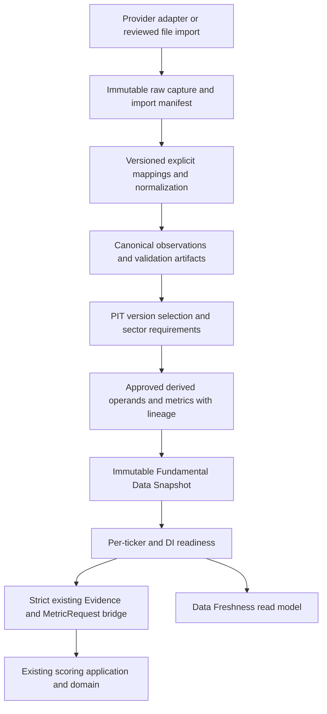

# Fundamental Data Engine — first-run design review

Date: 2026-10-08 (Asia/Ho_Chi_Minh). Status: **PROPOSAL — A–H COMPLETE FOR REVIEW; IMPLEMENTATION NOT AUTHORIZED**.

Audited checkout: `40a7f9557ea8492d80bebe8e3928bdbe171020d3`; working tree was clean before this document. This report assesses checked-in code, contracts and evidence, not the contents of the user's private database. No credentials, personal captures or production database were read; no API account requests, migrations, live scoring, rankings or recommendations were run. External research below used public documentation only. Tests were inspected, not executed; their existence is not a new PASS claim.

Recommendation: build vendor-independent contracts and additive analytical storage first. Qualify a structured provider against original disclosures before integration. Preserve the existing evidence, methodology, exact arithmetic and immutable artifact architecture. Financial coverage is necessary but insufficient for a complete score: the current engine also requires human qualitative assessments and external gates.

## A. Repository audit

### Authority reviewed

Paths are repository-relative. Logical paths printed inside older documents sometimes differ from physical paths; use the physical paths below. Some headers still say Draft/Approval Candidate despite the user's stated approved M1–M8 baseline. This report does not downgrade that authorization or silently edit headers. Freeze actual approved document hashes/approval references before implementing a production requirements matrix.

| Authority | Consequence for this engine |
|---|---|
| `docs/01 SYSTEM/INVESTMENT_POLICY.md` | VN30-only new capital; Stage 0; quality/health precede valuation; no forced deployment; portfolio truth separate. |
| `docs/01 SYSTEM/DECISION_FRAMEWORK_v1.0.md` | Score informs judgment; market/technical are secondary context; complete decision sequence remains authoritative. |
| `docs/01 SYSTEM/RISK_POLICY_v1.0.md` | Vetoes, leverage prohibition, confidence and portfolio constraints cannot be overridden by better data or scores. |
| `docs/01 SYSTEM/SCORING_MODEL_v1.0.md` | Frozen 25/15/15/10/20/10/5 category maxima; no extra API metric creates points. |
| `docs/03 SCORING/METRIC_DEFINITIONS.md`, §§2–3, 11–18 | TTM/current state, minimum 3Y/preferred 5Y trends; attributable common profit/average common equity; normalization, source hierarchy, missing rules, corporate-action comparability. |
| `docs/03 SCORING/SECTOR_NORMALIZATION.md`, §§5–14 | Sector-equivalent economics; special bank, securities, insurance, property, cycle and conglomerate treatment. |
| `docs/03 SCORING/SCORING_ENGINE.md` | Flow/technical excluded from permanent 100-point score; evidence-based assessment, not automatic ratio-to-points. |
| `docs/03 SCORING/RANKING_RULES_v1.0.md` | Reliable scoreability, confidence, category/eligibility gates, deterministic ties; no ranking policy changes. |
| `docs/02 DATABASE/DATA_MODEL.md`, `DATA_RULES.md`, `VN30_MASTER.md`, `SECTOR_MASTER.md` | Ledger owns investor economics; durable security identity, effective-dated master/reference truth, explicit quality and units. |
| `docs/07_VALIDATION/DATA_VALIDATION.md`, `HISTORICAL_VALIDATION_PLAN.md`, `FINAL_VALIDATION_REPORT.md` | Publication-time and restatement controls; AS-KNOWN distinct from AS-REVISED; historical validation remains blocked pending execution evidence. Specification completion is not certification. |
| `docs/08_CONTINUOUS_IMPROVEMENT/DATA_INITIALIZATION.md`, `INITIAL_SCORING_REPORT.md` | DI1–DI15 evidence, reproducible dataset identity, per-ticker readiness and independent review precede live scoring; SC1–SC12 still separate. |
| `docs/adr/0001-module-boundaries.md`, `0003-sqlite-prisma-persistence.md`, `0004-portfolio-ledger-and-accounting.md` | Dependency direction, explicit migrations, private local SQLite, decimal TEXT, immutable facts, projections remain derived. |

### Existing components and reuse

| Component / inspected files | What exists | Reuse / limitation |
|---|---|---|
| `src/domain/scoring/evidence.ts` | Versioned Evidence with durable securityId, source, FACT/ESTIMATE/ASSUMPTION, period, publishedAt, receivedAt, validThrough, units and quality. Validates future evidence and duplicate observation/period conflicts. | Final scoring boundary. It cannot represent nullable publication, raw vendor item, currency/scale, YTD or restatement chain. Do not force unknown dates into it. |
| `src/domain/scoring/metrics.ts` | Frozen `METRICS`, ordered operands, exact decimal formulas, comparability/normalization checks, missing result = null; bank exclusions. | Reuse formulas wherever operand semantics match. Formula IDs differ from document evidence IDs (e.g. ROE vs BQ-EQ-02); explicit crosswalk required. |
| `src/domain/scoring/scorecard.ts`, `methodology.ts`, `methodology/sectors.ts` | 11-sector taxonomy, 23 rubric assessments, HUMAN assessment requirement, confidence, evidence topics, external Stage 0/veto/risk, null total when critical inputs fail. | Keep assessment and gate ownership. Provider ratios cannot fill human rubrics or normalized estimates automatically. |
| `src/application/scoring/engine.ts`, `src/ports/scoring.ts` | Registry identity checked before persistence; score/rank application orchestration; analytical append/find port. | Add production readiness at application boundary later; current score() has no DI manifest lookup. Existing evidence checks alone do not enforce all initialization gates. |
| `src/domain/ranking/rank.ts` | Recomputes cards from pinned inputs; requires complete 30-member/card coverage; missing universe/card blocks ranking; external return and portfolio gates; deterministic ties. | Preserve whole-universe accounting. Ready subset must not silently become a supposedly complete VN30 universe. |
| `src/domain/portfolio/reference.ts` | Effective-dated identifier/membership/sector/coverage, tri-state membership; complete coverage requires 30 distinct members. | Reuse reference semantics and security IDs; ingestion-time universe/sector evidence still needs a pinned analytical reference manifest. Count alone does not prove official membership. |
| `prisma/schema.prisma` | Security, ledger, MethodologyRecord, AnalyticalArtifact, DecisionArtifact, workflow/marginal artifacts, BrokerObservation. | No fundamental observation, import batch, financial derivation or fundamental dataset snapshot tables. Security is already the shared durable identity; do not duplicate a company/security master. |
| `src/infrastructure/repositories/analytical-artifacts.ts`, scoring migration | Append-only SCORECARD/RANKING JSON + SHA-256; read integrity checks; triggers prevent mutation. | Reuse immutable body/hash pattern. Port/type and read discriminator accept only scorecard/ranking; cannot just insert FUNDAMENTAL_SNAPSHOT into it. |
| `src/infrastructure/repositories/broker-observations.ts`, `src/infrastructure/tcbs/{collect.ts,sync.ts,normalize.mjs}` | Raw captures plus normalized broker snapshots; hash checks; latest successful response views; bounded sync and preserved older observations. | Reuse capture/lineage design, not private account tables for public issuer statements. Latest-success queries are not PIT fundamental queries. |
| `src/ports/current.ts`, `src/infrastructure/current-source.ts`, `src/shared/validation/current-source.ts` | Normalized local CurrentSource provider for portfolio prices/references/reconciliation/analyst review evidence. | This is portfolio-scoped, not a financial statement provider. Keep it; add a narrow fundamental provider port rather than widening portfolio source ownership. |
| `src/application/current/read-model.ts`, `src/application/dashboard/model.ts`, `src/ui/dashboard.tsx` | Current portfolio freshness/integrity plus historical artifacts; /data explicitly sets Fundamental freshness to null. | Extend read model/UI only after snapshot/readiness. No existing full-universe fundamental coverage counters. Broker sync READY is not DI PASS. |
| `src/shared/time.ts`, `src/domain/portfolio/values.ts`, `src/infrastructure/db/exact-decimal.ts` | Canonical UTC instants/date-only, clock, decimal strings and BigInt decimal12 half-even arithmetic. | Reuse; do not introduce floating point or domain IO. Raw lexical values must survive normalization limits. |
| `src/infrastructure/config/{database.ts,tcbs.ts}`, `logging/logger.ts`, `app/server/`, `scripts/database.mjs`, `scripts/backup.mjs` | Private server config, allowlisted safe logging, server composition, explicit migration wrapper and backup/recovery workflow. | Preserve all TCBS controls. New credentials use analogous private server handling and are excluded from tracing, git, logs, raw headers and UI. |

### TCBS assessment from actual integration

`api/tcbs-api-catalog.json` explicitly records “Fundamental financial statements require an additional source.” `api/README.md` later sections and executable sync supersede its stale introductory claim that no client exists. Existing calls cover profile/account/cash/positions/orders/matches/debt, tickerCommons(index=2), securities metadata, intraday prints and supply/demand. Intraday history is only latest 20 prints per held ticker; cash/debt pagination is incomplete. Market observations and broker portfolio holdings are not issuer financial statements. The held-ticker collection loop is not full VN30 fundamental coverage.

No audited adapter supplies income/balance/cash-flow history, publication timestamps or restatement versions. This supports **TCBS currently insufficient**, not a claim that no TCBS product anywhere has fundamentals. Public TCBS portal describes trading, realtime market and account capabilities; a separate TCBS analytics endpoint would need its own documentation, terms and qualification. Do not discover hidden endpoints as an implementation shortcut.

### Tests and boundaries inspected

`tests/unit/scoring.test.ts` already rejects future publication/reference evidence; `scoring-golden.test.ts` and `methodology-validation.test.ts` pin rules. `tests/integration/scoring-artifacts.test.ts` covers immutable round-trip, corrections, UPDATE/DELETE/REPLACE rejection, populated upgrade and ledger preservation. `portfolio-migration.test.ts`, `numeric.test.ts`, `isolation.test.ts`, `file-safety.test.ts`, `broker-observations.test.ts`, `tcbs-sync.test.ts` and API session tests provide migration, exactness, security and adapter patterns. `tests/fixtures/database.ts` allocates private temporary DBs and runs migration with `--no-env-file`; `vitest.config.ts` uses UTC and one worker. Architecture checks in `scripts/check-boundaries.mjs` constrain even type imports and client transitive graphs.

Pure domain → domain/shared; ports → domain/shared/ports; application → ports/domain/shared/application; infrastructure may implement ports; server composition wires IO; UI consumes read models. No provider fetch, Prisma, node crypto, environment reads or wall clock in domain. No new dependency is required for the first slice. Before any future code, read the relevant installed `node_modules/next/dist/docs/` guides per AGENTS.md.

### Gaps, conflicts and migration implications

1. No complete issuer fundamental store/provider/normalizer/PIT selector/derivation manifest/readiness registry exists.
2. Existing `validateEvidence` uses publishedAt <= knownAt and receivedAt <= knownAt, with asOf <= knownAt. A historical decision must not gain later-publication data by moving knownAt forward. Future bridge must constrain decision availability separately before creating Evidence.
3. Scoring Evidence duplicates with the same observation and period conflict even when they represent a later restatement. Select one eligible version first; preserve all versions in storage, not all in a scoring input.
4. `calculateMetrics` checks equal operand units and (usually) equal periods, but does not prove canonical operand identity or correct average-equity lineage. Revenue/EPS CAGR endpoint observations need explicit comparable window operands to fit this contract. An adapter must build semantic operands, not merely pair any matching unit/period.
5. NIM, CAR, ROA and insurance formula coverage is not equivalent to adding those IDs to executable METRICS. Some approved items are evidence topics with qualitative/context requirements, rather than implemented formulas. Do not silently add formula/annualization policies.
6. Securities/insurance are described as possible metrics in sector normalization, not an unconditional mandatory numerical checklist. Requirements must reference the selected approved evidence route; unresolved applicability/definition is blocking.
7. Financial freshness depends on latest officially available period/audited FY, not generic elapsed days. Unknown freshness policy or incomplete disclosure monitoring remains UNKNOWN.
8. A portfolio snapshot/ledger watermark cannot stand in for a universe financial dataset. Reuse its lineage principles, retain distinct IDs and ownership.
9. Future schema is additive; no alteration of ledger transactions, portfolio projections, cost basis or broker captures. No production migration during this review. Security may have only held companies; universe identity initialization must later add authoritative Security records through the existing owner, not fabricate them.

## B. Fundamental data source assessment

Research date 2026-10-08. **F** = directly supported fact; **A** = planning assumption/inference; **U** = unknown requiring verification. Public product claims are not measured coverage, contractual rights, independent financial correctness or PIT certification.

| Candidate | Coverage and statement/history evidence | Dates, restatements and PIT | Access, limits, terms, reliability/stability and effort |
|---|---|---|---|
| Existing TCBS OpenAPI | **F:** audited repo has market/account integrations; no statement adapter; explicit source gap. Portal describes market and trading/account data. **U:** separately licensed fundamental offering. | **F:** current market capture often uses receipt time, not verified exchange publication; no fundamental version chain. Unsuitable as sole fundamental/PIT source today. | **F:** existing API key + Smart OTP/JWT, private cache, 401/429 stop and bounded sync. **U:** statement entitlement/limits/terms. Stable enough for existing scope only; extra API would require separate qualification. |
| Original issuer disclosures plus official exchange/regulatory/index notices; controlled document import | **F:** issuer IR can expose quarterly consolidated statements and annual reports (FPT example linked below). **A:** all active constituents can be covered by a maintained disclosure register; must prove each. All three statements/notes depend on report. History depth varies. | Strongest evidentiary route if original document, publication record and every version are retained. **U:** precise publication time, archived originals and restatement history per issuer. Document signing/report date is not publication date. | Public pages may require no login; no universal documented bulk API established here. Automated downloads/rates/storage rights need site-specific verification. Manual/approved export ingestion avoids undocumented endpoints; high extraction/review effort and website/PDF layout changes. Original provenance does not eliminate extraction mistakes. |
| FiinGroup API Datafeed / FiinPro X | **F:** Datafeed documents corporate financial data; product guide advertises quarterly/annual listed-company history since listing. **A:** candidate for full VN30; API entitlement may differ from platform. **U:** actual 30/30, sector notes, consolidated vs separate, depth and field completeness. | **U:** item-level original availability timestamps, timestamp precision/timezone, AS-KNOWN query/version history, revisions and original PDFs. Fast update claim does not prove historical PIT. | **F:** documented API product, not a browser-only shortcut. **U:** auth scheme, quotas, SLA, price, local persistence/replay/export rights and contract duration. **A:** medium implementation effort and potentially more stable contractual support than a community bridge; sample proof required. |
| Vietstock DataFeed | **F:** official Vietstock materials list a DataFeed product. **U:** exact financial API/schema, quarterly/annual depth, VN30 sector coverage, note-level fields. | **U:** publication timestamps, original/restated versions and PIT access. Treat current tables as latest-revised until proven otherwise. | **U:** API docs, authentication, licensed storage/reuse, quotas and SLA. **A:** commercial alternative worth qualifying; medium/high effort until specification received. No website scraping proposed. |
| Vnstock library and underlying providers | **F:** maintained upstream README exposes fundamental balance-sheet access and API-key registration. Library is an access layer, not the original issuer source. **U:** pinned release/source-specific full statement/history coverage. Old TCBS examples are not evidence for a current documented TCBS OpenAPI fundamental service. | **U:** exact availability fields/version retention. Receipt time and period labels alone fail historical PIT. Do not infer original vintages from current historical tables. | **F:** current README includes key/quota arrangements; do not assume anonymous/unlimited use. **U:** numerical quota for selected tier/release, upstream permission and data storage rights (software license is separate). **A:** extra Python/runtime bridge and upstream schema risk; lower fit for this TypeScript repo. Research-only candidate until terms/PIT proof. |
| WiChart / WiData | **F:** wichart.vn redirects to widata.vn; public retrieval exposed no usable specification. **U:** all coverage, statement/history fields, API access/auth/quotas/terms/SLA. | **U:** publication and revision metadata. No PIT claim justified. | **A:** possible provider to evaluate only after documentation and entitlement. Complexity/stability cannot be responsibly rated yet; no hidden endpoint integration. |

Source facts: [TCBS developer portal](https://developers.tcbs.com.vn/); [FiinGroup API product](https://dff.fiingroup.vn/ApiDataFeed?lang=vi-vn); [FiinGroup API documentation](https://datafeed.fiingroup.vn/api-doanh-nghiep); [FiinPro X guide](https://docs.fiinpro.com/english); [Vietstock official overview](https://en.vietstock.vn/about-us.htm) and [official product guide](https://static1.vietstock.vn/vietstock/2023/VSTF_Huong-dan-su-dung_ver2023.pdf); [Vnstock upstream README](https://github.com/thinh-vu/vnstock); [WiChart redirect](https://wichart.vn/); [FPT investor disclosures](https://fpt.com/en/ir). These establish only the limited facts explicitly labeled above.

### Safest practical strategy (recommendation, no provider commitment)

Use original audited/official issuer disclosure evidence as the provenance/resolution anchor under M3 §3.6 source hierarchy. Qualify FiinGroup first and Vietstock as an alternative structured acquisition route; retain original disclosure references for disputed, sector-specific and high-sensitivity items. If provider qualification fails, use reviewed document/export imports with full provenance and explicit missing states. Do not backfill a guessed publication date or automatically switch to an undocumented source after a failure. Community/website access is not the default production route.

Before choosing a provider obtain (without contacting anyone in this run):

- A frozen 30-ticker official universe and an item × ticker × period × sector coverage export. Include 3Y minimum/5Y preferred trends, original and restated examples, quarter/YTD/annual distinctions, consolidated/parent scope, audit status and notes.
- Documented API fields, lexical precision, currency/multipliers, page-completion semantics, version guarantees, authentication, quotas, timeout/retry policy and SLA/change notification.
- Examples proving original public availability timestamps with timezone/precision and documentary references. Test a delayed Q2 release and later revision. Ask whether historical values are revised in place.
- Contract rights for local raw retention, historical replay, derived metrics, backups and exported review evidence. Confirm any restriction on retention after contract termination. No assumption that a paid subscription grants redistribution.
- Independently reconcile representative bank, securities, insurance, cyclical and ordinary issuers, then account for every active member; sector probes may use non-VN30 fixtures without making them investment eligible.

Source selection is evidence-driven, not based on the most attractive score. This assessment is complete as a desk assessment; source acceptance remains unverified.

## C. Gap analysis and sector requirements

| Current system | Required engine | Gap / owner |
|---|---|---|
| Effective-dated reference contract; TCBS tickerCommons capture | Official dated universe/sector evidence and complete coverage | Qualification/import manifest, not current ticker list as historical truth. |
| Broker account/market raw storage | Public issuer statement observations by durable security | Narrow issuer capture port and append-only repository. |
| Generic scoring Evidence | Canonical raw/normalized financial item with fiscal/scope/version metadata | Canonical observation contract plus strict bridge to existing Evidence. |
| Decimal strings and formulas | Explicit vendor maps, scale/sign/period/scope transformations | Versioned mappings and auditable transformations; no automatic financial normalization. |
| Evidence-level quality/PIT checks | Item validation, conflicts/restatements, period graph and publication controls | Pre-score validation and eligible-version selector. |
| Embedded score metrics/operands | Reusable approved derivations with full lineage | Thin wrapper around existing formulas, explicit derived operands; no competing scoring calculator. |
| Portfolio snapshots and frozen score bodies | Immutable universe financial dataset manifest | Distinct fundamental snapshot; reuse body/hash persistence pattern. |
| Null fundamental UI freshness | Per-ticker required-route completeness and all-input readiness | Application readiness + read model; M8 DI enforcement at production entry. |
| Synthetic regression evidence | Independent real-data initialization evidence | Full universe ingestion, independent checks and DI sign-off; no PASS from code. |

### Canonical capture inventory (not a new scoring metric list)

Income: consolidated revenue, gross profit when applicable, operating profit, EBIT with definition, profit before tax, total NPAT, NPAT attributable to common shareholders, basic/diluted/reported EPS and denominator basis. Balance: assets, total equity, common equity/minority distinction, cash equivalents, restricted/unrestricted cash, interest-bearing debt and short/long-term components. Cash flow: CFO, investing/financing flows, capex line items and sign convention; FCF is derived, never presumed equal to investing outflow.

Each field has applicability and a documented approved use. Bank net interest/operating income is not industrial revenue; total equity is not automatically common equity; NPAT is not automatically attributable common profit; investing cash flow is not capex; operating profit is not automatically normalized EBIT; reported EPS is not normalized/action-adjusted EPS. Accept negative earnings/equity/CFO/FCF where economically possible. Capture shares and corporate-action terms where required for comparable EPS/BVPS. Estimates, conservative valuation ranges, forecast dividends and analyst adjustments remain explicitly separate from reported FACTs.

| Sector | Approved evidence needs | Implementation boundary |
|---|---|---|
| BANK | M3 metric definitions §11.1 and sector §5: sustainable ROE/ROTE, NIM quality, fee quality, cost-to-income, CASA/funding; CAR/CET1 where available, NPL/coverage, LDR/liquidity, credit cost/stress; loan/deposit/fee/BVPS/EPS growth and capital consumption. | Bank-specific statement/notes operands; preserve regulatory definitions. NPL/COVERAGE/CASA/ROE already have formula support. ROA may be sector-appropriate evidence under scoring model §5.1 but is not blanket mandatory and has no existing MetricId. NIM/CAR annualization/calculation definitions require an approved mapping or reported evidence, not invented formulas. No industrial Debt/Equity, CFO conversion, interest coverage or ROIC substitutions. |
| SECURITIES | Sector §13.1: through-cycle ROE, recurring fees, market-share economics, proprietary-trading dependence, margin-loan concentration, liquidity/capital adequacy, turnover sensitivity; sustainable P/B/P/E context. | Possible evidence routes need explicit applicability and reviewer approval under existing model. Do not treat trading gains as recurring fees or industrial cash conversion as automatically equivalent. |
| INSURANCE | Sector §13.2: underwriting profitability, combined ratio where applicable, reserve adequacy, investment-income quality, solvency capital, premium-growth quality. | Insurance scope and definitions vary (e.g. combined-ratio applicability); no universal mandatory combined-ratio or industrial net-debt shortcut. Missing precise formula ownership is BLOCKED_REQUIREMENT_UNRESOLVED. |
| Non-financial sectors | ROIC/normalized ROE as appropriate, margins, CFO conversion/FCF, net debt/unrestricted cash, maturities/coverage, revenue/EPS growth. Property requires collections/backlog/legal/inventory/RNAV; retail store economics; technology recurrence/concentration; materials through-cycle; utilities/energy and conglomerates use approved sector matrix. | Support supplement/document evidence, not only three statements. Conglomerate cash cannot automatically net holding debt; cycle and one-off adjustments need human rationale and sources. |

A versioned requirements crosswalk must contain document metric/evidence ID → rubric topic → applicable sector/evidence route → canonical inputs → existing executable metric (if any) → period/corporate-action/normalization constraints → missing rule. This is the acceptance artifact for completeness; a hardcoded universal 20-field checklist is insufficient. Optional fields cannot become mandatory simply because a vendor supplies them.

## D. Proposed architecture



Suggested modules: `src/domain/fundamentals/{contracts,validation,requirements,normalization,selection,derivation,snapshot,readiness}.ts`; `src/ports/fundamentals.ts`; `src/application/fundamentals/{ingest,build-snapshot,readiness,scoring-input}.ts`; `src/infrastructure/fundamentals/` adapters/maps; `src/infrastructure/repositories/fundamentals.ts`; future server wiring under `app/server/`. Names are proposals, not generated code. Keep financial-statement source items distinct from scored derived MetricId; reuse Sector, Security, time, decimal and existing metric definitions.

### Observation and transformation model

Canonical observations retain securityId and supplied ticker/identifier mapping reference; canonical item ID; statement family; consolidation scope; segment where applicable; accounting standard/audit status; periodStart/end; QUARTER/YTD/ANNUAL/INSTANT (TTM explicitly derived or labeled vendor aggregate); fiscalYear/quarter; period semantics; publication/available metadata; actual retrieval/ingestion; raw capture/field locator/raw lexical value; source unit/multiplier/currency; exact normalized value/unit; status; mapping/version/transformation trace; restatement/correction identity and predecessor. Fiscal calendar is explicit, not inferred universally from Gregorian quarters.

Example mapping specification (illustrative until vendor qualified): `netProfitAfterTax` → `reported_net_profit_after_tax` (not normalized common profit); declared million VND × `1000000` → VND; exact decimal parse; reporting scope/period preservation; mapping version + raw field path; no adjustment. `15000` million VND produces `15000000000` VND. Percent `15` explicitly declared PERCENT maps to RATIO `0.15`; RATIO `0.15` stays `0.15`. Currency is required for monetary values; nonmonetary values use null currency. Supported source units include VND/thousand/million/billion, percent/ratio, shares/thousand shares and VND/share. Unknown multiplier, scale ambiguity or excess exact precision fails normalization; do not round away a source fact.

Represent availability, quality, freshness and applicability separately: availability AVAILABLE/MISSING/SOURCE_UNAVAILABLE; quality VALID/WARNING/INVALID/CONFLICTING/UNKNOWN; freshness CURRENT/AGING/STALE/UNKNOWN with policy/evaluation reference; applicability APPLICABLE/NOT_APPLICABLE/UNRESOLVED. Provide requested combined display states through a deterministic projection. NOT_APPLICABLE needs approved sector/route rationale, never a missing-data escape. Numeric zero remains AVAILABLE with `"0"`; missing normalized value is null. M8 INSUFFICIENT confidence remains at readiness layer; only valid HIGH/MEDIUM/LOW evidence assessments bridge into the existing score contract.

### PIT and revisions

Separate `decisionAsOf`, `systemKnownAt`, `generatedAt`, market cutoff and fundamental cutoff. Public availability must be <= decisionAsOf; actual retrieved/ingested time must be <= systemKnownAt. For operational AS-KNOWN replay enforce systemKnownAt <= decisionAsOf: information the system acquired later cannot be represented as previously known. A historical-public research dataset may be built later only with independently verified original availability and original vintage, explicitly separate from operational replay. Current Evidence requires receivedAt <= knownAt; this design proposes **no historical bypass or rewriting of receivedAt**. Any later bridge for historical-public mode needs separate reviewed semantics and cannot relax the production entry point.

PublishedAt/availableAt can be null in canonical storage, with `VERIFIED_TIMESTAMP`, `VERIFIED_DATE_ONLY`, `UNKNOWN` precision/status and evidence reference. Never substitute reporting period or retrievedAt for publication. Conservative date-only admission at the end of that local publication day is a proposed operational rule to approve and version; until then classify uncertain intraday admission UNKNOWN. Records with unknown public availability remain preserved but ineligible for readiness/scoring under the initial fail-closed policy. “First observed at retrieval” is useful system evidence, not proof of the original historical publication date.

AS-KNOWN selects only eligible original/restated vintages published and actually known by the applicable cutoffs. AS-REVISED selects latest valid revised data at a declared later revision cutoff and must be labeled; never feed that mode into an AS-KNOWN score. Distinguish issuer restatement from provider correction, mapping correction and repeat retrieval. Retain all versions; supersession is a new append-only link/event, not an update to the old record. Explicit source resolution survives in the snapshot. No averaging or preference for a favorable value. Changed content without a documented version/change explanation is CONFLICTING/UNKNOWN.

Mandatory regression: period end `2026-06-30`, publication `2026-07-25`, snapshot as-of `2026-07-10` → excluded from accepted inputs and derived metrics, regardless of its reporting period. Also test publication exactly at cutoff, receipt after cutoff, late restatement and backdated vendor availability.

### Validation

Structural: valid durable security/ticker resolution, membership/sector at requested date, recognized canonical item, fiscal calendar and period ordering, numeric lexical parse, declared unit/currency/scale, field scope, payload schema/page completeness and valid timestamp chronology. Unknown identity/metric never flows to scoring; raw rejected evidence remains auditable.

Financial: negative total assets/debt where impossible; share count conventions; fractions bounded only for quantities that mathematically require it (e.g. NPL/CASA); coverage ratios can exceed 100%, ROE/ROA/NIM are not universally clamped to 0–100%. Negative EPS/profit/CFO/equity is possible. Zero denominators yield N/R or blocked according to approved rule. Compare debt components, balance-sheet identities and price × shares vs market cap where compatible; permit documented rounding, minority/scope and accounting distinctions. Suspicious discontinuity or 1,000×/1,000,000× shift triggers review and blocks if materially unresolved, never automatic rescaling/deletion. Numerical materiality tolerances require operational ownership/version, not a threshold chosen to get PASS.

Cross-period: compatible quarter/YTD/annual flow semantics, no gaps/overlap in TTM, no summing balance-sheet stocks or EPS indiscriminately; YTD subtraction only from comparable scope/version periods; restatement-consistent inputs, average balance lineage, corporate-action comparability, one-offs/cycle adjustments and denominator period pairing. Completeness follows approved sector/evidence-route requirements. Validation artifacts record rule/version, target IDs, severity, result, issue ID, reviewer/resolution evidence and timestamp.

### Derivations, snapshot and readiness

Reuse `calculateMetrics` for existing formulas with correct canonical operands and request normalization. Derived records include formula identity/version, methodology/document hashes, ordered observation/derived input IDs, period(s), normalization rationale/references, units, exact result or null/reason, precision policy and calculatedAt. Derived operands (average common equity, TTM CFO, normalized common profit, corporate-action-adjusted EPS) need their own lineage; vendor ROE is a reported provider ratio, not an unexplained internal calculation. Financial normalization involving judgment remains an explicit reviewed adjustment. Confidence cannot exceed weak required inputs by default.

Snapshot seals sorted accepted observation/derived IDs **and hashes**, pinned universe/sector/market/reference content or immutable resolvable bodies, source/import/mapping identities, cutoffs/mode, selected revisions/resolutions, requirements/validation/freshness versions, missing/excluded items, readiness, methodology/build identity. Canonical serialization sorts sets by documented code-point order, preserves ordered formula operands and normalizes UTC/decimal transport. Immutable creation envelope holds generatedAt separately from deterministic content identity; repeated identical inputs/policies/cutoffs yield identical content hash even at a later execution time. Changed input, selection or policy yields a new identity. Bodies and references are checked on load; missing lineage/hash mismatch fails closed. Publication of header/members/readiness is atomic; later arrivals cannot alter an old snapshot.

Readiness table: ticker/security | universe | market | fundamentals | valuation inputs | flow/technical | evidence confidence | assessment/gate completeness | ready for scoring | blockers. Flow/technical may be NOT_APPLICABLE for permanent M3 score with baseline reference, but required for relevant M4 workflow; never add points or always block M3 for an optional overlay. Data-ready, fully score-ready and actionable remain distinct. Missing bank NIM quality evidence can produce `BLOCKED_MISSING_NIM_EVIDENCE`; unknown publication `BLOCKED_PUBLICATION_UNKNOWN`; stale statements `BLOCKED_STALE_FUNDAMENTALS`; missing human rubric/gate evidence `BLOCKED_ASSESSMENT_REQUIRED`. These are illustrative reasons, not claims about actual tickers.

Future production scoring integration must look up sealed snapshot and matching evidence/model/universe, check required DI PASS with independent review artifact and per-ticker score readiness, and assemble strict existing input. A caller-supplied READY boolean is insufficient. Keep synthetic test paths explicitly scoped; no bypass for FORMAL production. Old score artifacts without the new dataset link remain immutable historical artifacts and cannot claim new production readiness.

## E. Proposed schema changes — no migration applied

Physical design follows existing SQLite TEXT timestamps/decimal strings and JSON-body/hash artifact patterns. This is an entity/constraint proposal for review, not executable Prisma/DDL. Slice 1 implements only the foundational subset listed in G/H; later tables are shown to review the full direction before migration.

| Proposed entity | Fields / reason | Indexes and constraints |
|---|---|---|
| FundamentalSourceVersion | id, provider identity, documentation/terms references, adapter/schema version, declared coverage/temporal limitations, recordedAt, body/hash | Immutable identity. Credentials are excluded. Version new terms/capabilities without editing history. |
| FundamentalImportBatch | id, sourceVersionId, request/import fingerprint, retrieval started/completedAt, ingestedAt, completion/error state, body/hash including page/capture manifest | FK source; index(sourceVersionId, completedAt); unique import execution identity. Immutable terminal manifest; partial batch can retain captures but cannot claim complete coverage. No mutable job status required in this initial design. |
| FundamentalRawCapture | id, sourceVersionId, importExecutionId, request/resource fingerprint, sourceRecordId/version nullable, retrievedAt, mediaType, response status, payload text or content-addressed blob reference, payloadHash, safe document reference | FK source; index(sourceVersionId, retrievedAt), index(importExecutionId). No authorization headers/token-bearing URLs. Preserve retrieval occurrence separately from payload content deduplication; same value retrieved twice has two receipt events. Batch manifest resolves captures without cyclic mandatory FKs. |
| FundamentalObservation | id, rawCaptureId, securityId, identifierReference, canonicalItemId, statement/scope/segment/accounting/audit basis, periodStart/end/type/fiscalYear/quarter, publishedAt/availableAt nullable, availabilityStatus/precision/timezone/evidence ref, ingestedAt, source version, raw field path/value/unit/multiplier/currency, normalized decimal/null and unit, mapping version/transform trace, recordVersion/revisionKind, supersedesObservationId nullable, availability/quality/applicability, body/hash | FK Security/capture/predecessor RESTRICT; index(securityId,item,scope,periodEnd,availableAt), index(sourceVersion,ingestedAt), index(supersedesObservationId). Unique(capture,item,scope,period,fieldLocator,mappingVersion) for reprocessing idempotence; not unique(security,item,period), which would erase conflict/revision evidence. Typed checks enforce null/value/status compatibility and fiscal/temporal ordering; decimal validation in repository/domain. |
| FundamentalValidationArtifact | id, ruleSetVersion, assessedAt, target refs, results/severity/issue refs, resolutions and reviewer, body/hash | Index(assessedAt); immutable, reference targets checked; later review/correction is a new artifact. Missing anticipated item represented as a finding, not fabricated source observation. |
| FundamentalDerivedMetric + DerivedInput | id, securityId, canonical/existing metric ID, formula/version, method/document/precision identity, periods, exact result/null, unit, calculatedAt, normalization, body/hash; ordered input rows with input observation or derived ID/hash | FK methodology/input targets RESTRICT; unique(derivedId,sequence); exactly one input target; index(securityId,metric,periodEnd). Validate acyclic graph and inherited quality in application/domain; formula not in SQL trigger. |
| FundamentalDataSnapshot | id/contentHash, contractVersion, mode, decisionAsOf/systemKnownAt, market/fundamental cutoffs, universe/sector/reference/market identities+hashes, methodology/build/policy identities, quality/freshness/readiness summary, immutable manifest body/hash, generatedAt envelope | Unique deterministic content identity; index(decisionAsOf,mode). Resolved external refs must be pinned bodies or immutable checked references; do not pretend a FK exists to a nonpersisted reference version. Atomic seal. |
| SnapshotObservation / SnapshotDerived / SnapshotTickerReadiness | snapshotId, referenced observation/derived ID+hash; per-security readiness body/hash with dimensions/blocker refs/requirements version | PK(snapshotId,targetId), PK(snapshotId,securityId); restrictive FKs; immutable membership/readiness. Full approved universe accounted for even when blocked. |
| ScoringDatasetBinding (later) | scorecardId, snapshotId, scoring input hash, requirements version, validation/DI acceptance reference, createdAt, body/hash | FK analytical artifact + snapshot RESTRICT; unique(scorecardId). Check kind SCORECARD and exact input/model/cutoff match. No rewrite of existing scorecard bodies. Historical bindings cannot be retroactively invented without evidence. |

Normalized monetary values use decimal TEXT; raw lexical values may be nonnumeric and survive failed parsing. UTC timestamp strings must be canonical for ordering; date-only cannot masquerade as UTC timestamp. Unit/currency/state/statement/scope checks require explicit enum allowlists in runtime validation and feasible SQL CHECK constraints. Unknown future item identifiers do not automatically become approved metrics. No DB enum permits changing investment rules.

All new fact/artifact tables receive UPDATE/DELETE guards, including replacement resistance with existing recursive_triggers connection policy. Test direct SQL UPDATE, DELETE, INSERT OR REPLACE and ON CONFLICT mutation. Foreign keys use RESTRICT, never cascading deletion of provenance. Semantic conflicts are stored and resolved by a reviewed append-only selection artifact, not a unique key that discards the second source.

Migration safety: additive DDL only; review SQL/schema before any deployment; fresh and populated isolated DB upgrades, repeat deploy, reopen, schema/FK/trigger checks, byte/row identity comparisons for all old authoritative tables and deterministic portfolio replay. Never use default `pnpm db:migrate` on the user's DB during design or tests. Backup/recovery: retain verified pre-upgrade private backup and manifest; prefer forward correction. Restoring a pre-upgrade backup after new ledger entries would lose those entries—stop writers and preserve/reconcile post-backup authoritative events first. No destructive down migration or reset. Raw blob storage, if needed later, must be private, hash-verified and included in backup integrity/recovery tests; first JSON capture slice can use TEXT to avoid introducing unreviewed blob lifecycle complexity.

## F. DI1–DI15 mapping

**No DI gate is newly PASS.** The authoritative document records all as NOT EXECUTED. Below “partial” means reusable implementation exists, not acceptance; “source-blocked” means a required real-data dependency is unqualified. No private database inspection was used to infer actual coverage. No gate can be labeled already satisfied on evidence available in this audit.

| Gate / exact requirement | Audit status | Implementation needed | Evidence required for PASS |
|---|---|---|---|
| DI1 VN30 master source/effective date verified | Partial; official effective-date acceptance unverified | Pinned official notice/identity import and availability/effectivity metadata | Independent notice/source/date/hash verification for exact cutoff. |
| DI2 Active universe complete/no duplicates | Partial; reference contract/count checks | Universe manifest and duplicate/identity validation | 30 authoritative distinct active securities, reconciled additions/removals and negative duplicate tests. |
| DI3 Sector mapping complete | Partial; taxonomy/reference checks | Complete dated approved-sector mapping | All active members mapped at cutoff; mapping/source approvals and historical interval checks. |
| DI4 Required market data loaded | Partial/source coverage unverified | Full required price/history/corporate-action coverage beyond held-ticker prints | Every required ticker/field/cutoff with provenance, quality, freshness and completeness; TCBS HTTP PASS alone insufficient. |
| DI5 Required fundamentals loaded | Source-blocked; engine not implemented | Qualified statement/supplement provider, raw/observation repositories | Full sector-route coverage report, latest available/audited periods and required history; representative source reconciliation. |
| DI6 Period/unit normalization validated | Partial primitives; fundamental normalization absent | Explicit field/unit/period/scope maps | Independent expected-vs-actual unit/sign/YTD/TTM/denominator cases and real samples, scale-error negative controls. |
| DI7 Missing-data checks PASS | Partial score fail-closed; full checklist absent | Sector required-route completeness and absent item findings | Whole-universe required-input accounting; zeros vs missing; approved N/A/fallbacks; affected outputs blocked. |
| DI8 Freshness checks PASS | Partial current price/reference; fundamental policy absent | Class-specific disclosure monitoring/freshness policy | Latest-public-period/audited-FY evidence at cutoff; stale/unknown/new-disclosure regression and owned policy. |
| DI9 Conflict/impossible-value checks PASS | Partial generic conflict/decimal checks | Fundamental conflict, financial, scale and cross-period rules | Material issues resolved with source evidence; valid negatives/coverage>100% retained; unresolved conflicts blocked. |
| DI10 Derived metric lineage verified | Partial embedded metric operands | Stored derivation graph/semantic operands/version bridge | Independent formula recomputation and full traversal to raw captures; missing/weak quality propagation. |
| DI11 Point-in-time controls verified | Partial Evidence checks; source-blocked publication/vintages | Selector/modes/publication precision/restatement controls | July 10/July 25 negative control, late receipt/revision/mode tests plus real publication references and original vintages. |
| DI12 Data Snapshot ID reproducible | Fundamental snapshot not implemented | Deterministic manifest, seal/load and integrity verification | Identical inputs/policies reproduce ID/input digest across order/reopen; changed facts yield new identity, prior replay unchanged. |
| DI13 Required per-ticker readiness determined | Not implemented for universe; partial score validity | All dimensions, assessment/gate and DI integration | Every active security accounted for; blocked reasons reproducible; injection/direct FORMAL bypass tests. |
| DI14 Independent data-quality review PASS | Not executed | Review artifact linked to exact snapshot/build/tests | Independent expected-vs-actual checks, reviewer identity/sign-off, immutable dataset hash and exception register. |
| DI15 No Critical/Major data issue unresolved | Not demonstrated | Severity/issue/resolution register, review enforcement | Complete scoped register and independent verified closure/retests; not inferred from absence of findings or passing unit tests. |

DI acceptance is tied to exact snapshot/policy/build identity and required scope. Failed snapshots/evidence remain retained. A later refresh needs new acceptance/readiness, not reuse of an obsolete PASS. Source failures must stay visible while previously received values retain original timestamps. DI PASS does not itself certify all M7 gates or satisfy SC1–SC12.

## G. Implementation slice plan

Commands are proposed validation, **not run in this review**. For any DB-consuming command use an owned private temp directory, explicit absolute `DATABASE_URL`, no personal env file and no network; use `tests/fixtures/database.ts` pattern. Schema validation/generation also receive a harmless isolated URL; no migration/startup against default DB. Existing wrappers may load root `.env.local`, so prefer `node scripts/database.mjs <command> --no-env-file` with explicit isolation. All slices preserve approved scoring golden tests/boundaries.

### Slice 1 — canonical contracts and foundational schema

Scope: narrow observation/raw/source/batch contracts, state/unit/period validation and foundational additive tables only. Approve canonical statement-item/evidence crosswalk; defer unresolved sector formulas. Implement append/read repository for foundational records, including integrity and private test fixtures. No fetching, normalization engine, derived tables, snapshots, UI or scoring connection yet.

Expected files: `src/domain/fundamentals/contracts.ts`, `validation.ts`; `src/ports/fundamentals.ts`; `src/infrastructure/repositories/fundamentals.ts`; `prisma/schema.prisma`; one new reviewed additive migration; `tests/unit/fundamentals-contracts.test.ts`, `tests/integration/fundamentals-repository.test.ts`, `fundamentals-migration.test.ts`; extend owned DB fixture only as necessary; contract/crosswalk review artifact under this directory. Reuse shared Security/Sector/time/decimal rather than duplicate them.

Tests: exact decimal/null/zero, units/currency, unknown dates, impossible chronology, raw preservation, duplicate identity/conflicting period versions, restrictive FKs, immutable raw/observation round-trip and UPDATE/DELETE/REPLACE guards; existing populated ledger/broker/artifact preservation plus reopen/repeat deployment. A dated future-publication fixture is stored distinctly, with no admissibility claim yet.

Commands: isolated `node scripts/database.mjs validate --no-env-file`, generate, `pnpm exec vitest run tests/unit/fundamentals-contracts.test.ts tests/integration/fundamentals-repository.test.ts tests/integration/fundamentals-migration.test.ts`, `pnpm test:boundaries`, `pnpm typecheck`, `pnpm lint`, `pnpm test:portfolio`, `pnpm test:scoring`, `git diff --check` (all process environments isolated as above).

Acceptance: foundational contract/schema reviewed; lineage and unknown availability representable without guessed timestamps; old authoritative records unchanged; tests supply evidence, not DI PASS. Risks: excessive early schema scope, incorrect canonical definitions, precision loss, shared Security initialization ownership and migration targeting mistakes. Stop for review before Slice 2.

### Slice 2 — qualified provider adapter and raw observations

Scope: only after explicit source selection/entitlement approval, implement one documented provider or reviewed offline import; capture every retrieval/page/error and immutable import manifest. Full-universe requests independent from portfolio holdings.

Files: `src/infrastructure/fundamentals/<approved-provider>.ts`, private config adapter, `src/application/fundamentals/ingest.ts`, ports/repository extensions; fixtures/parsing/security tests. Commands: focused provider/import tests, boundaries/typecheck/lint, TCBS regression `pnpm exec vitest run tests/integration/tcbs-sync.test.ts tests/integration/broker-observations.test.ts` and `node --test api/token-session.test.mjs`, diff check; no live API in CI.

Acceptance: independently verified contract fixtures; auth never exposed; bounded timeout/rates/pagination and partial-source states; retry preserves capture events; no canonical acceptance/scoring yet. Risks: licensing, endpoint drift, numeric JSON precision, missing timestamps/vintages. Live source qualification is separately authorized and evidenced, not assumed by this plan.

### Slice 3 — normalization and validation

Scope: explicit maps, lexical units/signs/currency/scope and period semantics, validation artifacts/conflict detection; no investment adjustments invented. Files: domain normalization/validation, provider mapping files, application normalization service, validation repository/table migration in isolation, unit/integration fixtures. Commands: focused normalization/validation tests, boundaries/typecheck/lint/scoring/portfolio regressions, isolated schema/migration checks, diff check.

Acceptance: million-VND and percent fixtures independently reconcile; no silent imputation/scale inference; YTD/annual distinctions and economically possible negatives; unresolved conflict/unknown mapping fail closed. Risks: vendor label equivalence, cumulative statements, capex sign, scope mixing, threshold ownership. Tests cover parsing, zero/missing, competing sources, magnitude shifts and wrong units.

### Slice 4 — approved derivations and sector requirements

Scope: approved requirement crosswalk and formula wrapper/derived operands using existing `calculateMetrics`; lineage for averaging/TTM/action adjustments, explicit human normalization artifacts. Files: domain requirements/derivation, application derivation, repository derived tables/input links, crosswalk/version evidence, sector fixtures. Commands: focused sector/lineage/precision tests plus `pnpm test:scoring`, `pnpm test:decision`, boundaries/typecheck/lint, isolated migration tests and diff check.

Acceptance: independent ROE/FCF/CASA/NPL examples reference correct original inputs and periods; no industrial bank substitutes, no generic mandatory insurance/securities formula; zero denominator/N/R and confidence propagation correct. Risks: missing approved definitions and normalized earnings judgments. Block unresolved routes, do not add a competing MetricId/formula to get completeness.

### Slice 5 — Data Snapshot and PIT controls

Scope: operational AS-KNOWN, labeled AS-REVISED, publication precision/version selection, immutable dataset manifest; historical-public bridge deferred unless separately approved. Files: domain selection/snapshot, application build-snapshot, snapshot membership repository/schema, time/version regression fixtures. Commands: focused PIT/snapshot/repository tests, boundaries/typecheck/lint/scoring, isolated migration checks and diff check.

Acceptance: July 10 excludes July 25 Q2 results from all selected and derived outputs; July 25 exact-boundary cases explicit; later receipt/restatement cannot leak; unknown availability blocks; same content produces same identity despite input order/new generation envelope; tamper/missing lineage fail; old snapshot stable after new imports. Risks: system/public clock confusion, date-only uncertainty, opaque references, mixed revision sets and noncanonical hash serialization.

### Slice 6 — scoring readiness integration

Scope: per-ticker all-input readiness and required DI acceptance lookup at production application boundary; strict canonical-to-Evidence/MetricRequest bridge; no automated human assessments or changed domain scores. Files: domain readiness, application readiness/scoring-input, `src/application/scoring/engine.ts`, scoring/ fundamental ports, dataset binding repository/schema, server runtime wiring only if needed. Commands: focused readiness/bypass/integration tests, scoring/golden/current/boundaries/typecheck/lint/portfolio checks, isolated migration checks and diff check.

Acceptance: FORMAL calls blocked with absent/mismatched/unreviewed snapshot/DI evidence; synthetic scope preserved; human/valuation/gate absence visible; full universe accounted for; flow/technical optionality follows M3/M4; snapshot binding immutable. Risks: retroactive lineage claims, global DI vs per-ticker scope, strict exact-key input compatibility and existing rank all-card rule. No live scoring during implementation validation.

### Slice 7 — Data Freshness UI

Scope: /data coverage/readiness and drill-down provenance, periods, public vs retrieval dates, freshness/warnings and lineage. Files: dashboard model/server read composition, `src/ui/dashboard.tsx` and evidence components; UI/integration/e2e fixtures. Commands: relevant installed Next guides first, `pnpm test:ui`, `pnpm test:current`, focused e2e in isolated build/test environment, typecheck/lint/boundaries and diff check.

Acceptance: counters derived from exact universe/snapshot, no fabricated 28/30; UNKNOWN/blocked visible; safe public DTO excludes credentials/private account capture; source drill-down resolves lineage. Risks: treating data readiness as actionability or confusing historical artifacts with current status. UI follows integrity work.

### Slice 8 — full VN30 initialization and evidence

Scope: after approval for real source access, ingest complete official universe/sector/market/fundamental inputs, independent normalization/formula/publication review, seal snapshot and publish DI evidence report. Files: approved import orchestration/runbook plus dated redacted evidence under `docs/fundamental-data-engine/`; no philosophy or score changes. Commands: slices 1–6 deterministic tests, isolated migration/populated recovery tests, `pnpm test:m68`, portfolio/scoring/decision/current/boundary checks, independent validation scripts approved for this dataset and diff check. A controlled real import command must be reviewed with its actual source/database target before execution.

Acceptance: each DI gate has measured evidence for exact dataset; all active tickers have readiness or explicit blockers; reviewer sign-off and Critical/Major issue register complete. A missing source field remains blocked; no all-PASS promise. Risks: source completeness, missing original availability/history, publication monitoring, real-dataset exceptions and storage rights. This slice produces initialization evidence only; live scoring/Top 10 remain a separately approved task with INITIAL_SCORING_REPORT preconditions.

## H. Exact Codex prompt for Slice 1 (use only after approval)

```text
Implement only Slice 1 of docs/fundamental-data-engine/DESIGN_REVIEW.md,
which the owner has explicitly approved. Stop after the Slice 1 review
report. Do not implement Slice 2 or advance milestones.

First reread AGENTS.md and the relevant installed Next.js guides in
node_modules/next/dist/docs/ before writing code. Audit the current diff
and preserve user changes. Read the A authority files and G Slice 1
scope; reuse existing Security, Sector, Evidence, METRICS, decimal/time,
MethodologyRecord, Clock, errors, persistence and boundary patterns.
Approved M1–M8 investment rules remain authoritative. If the repository
has materially changed, report the difference before expanding scope.

Deliver canonical fundamental source/capture/import/observation
contracts and validation, a narrow append/read port and infrastructure
repository, and only their foundational additive SQLite/Prisma tables.
Use the proposed E fields/constraints relevant to these entities; do not
create derived-metric, snapshot, readiness or scoring-binding tables yet.
Document the canonical statement-item to approved evidence/metric
crosswalk. Do not invent unresolved sector formulas or mandatory routes.
Do not add MetricId entries, scoring weights, score bands or policy rules.

An observation must preserve durable security identity and ticker mapping,
canonical item, statement/scope, fiscal period/type, raw lexical value,
declared unit/multiplier/currency, exact normalized value or null,
publication/availability date and precision/status including UNKNOWN,
actual retrievedAt and ingestedAt, source/capture/field references,
mapping/transformation version, and issuer-restatement/provider-correction
lineage. Missing is never zero. Reporting period is never publication
or retrieval. Null publication must be representable and must not be
converted into an admissible scoring Evidence object. Raw invalid values
remain auditable. No provider fetching or actual normalization engine
is in this slice; validate supplied canonical fixtures only.

Keep provider/Prisma/IO/crypto/environment/time access in infrastructure
or server composition. Keep credentials out of all contracts, captures,
logs and client DTOs. Preserve existing TCBS controls and private files.
Reuse exact decimal TEXT and immutable body/hash patterns. New tables
must prevent UPDATE, DELETE and replacement mutation and use restrictive
foreign keys. Allow multiple conflicting/revised records for the same
security/item/period; idempotence must not erase distinct retrievals.

Prepare migration SQL for review first and inspect its diff before
applying it anywhere. Apply it only to owned isolated temporary databases
with explicit absolute DATABASE_URL and --no-env-file, following the
existing database fixture. Never open, migrate, reset, restore or mutate
the real user's database. Never seed approval or real-data records.
Test fresh deployment, populated pre-slice upgrade, repeat deployment,
reopen, immutable repository round-trip, exact decimal and null/zero,
unknown dates, invalid periods/units, conflicting/revised rows, raw
retention, FK rejection, UPDATE/DELETE/REPLACE rejection and preservation
of existing ledger/portfolio/broker/analytical/methodology records and
portfolio replay. Include a Q2 2026 fixture with period end June 30 and
publication July 25; preserve both dates without claiming PIT selection
is implemented in Slice 1.

Run the Slice 1 validation commands with isolated database/configuration,
including relevant new tests, boundary checks, typecheck, lint, existing
portfolio/scoring regressions and git diff --check. Do not let wrappers
load personal environment/database files. Record exact command outcomes,
source identity, migration diff review, old-record preservation and
recovery considerations. Do not report any DI gate PASS merely because
code/tests exist. Return files changed, tests/evidence, remaining risks
and a Slice 1 acceptance report. No live scoring, Top 10, Buy/Sell advice,
provider integration, production database changes, commit or push.
```

**Stop:** A–H delivered. Await owner review and explicit implementation approval. No Slice 1 implementation is included in this document.
